[目次に戻る](index.md)

## MounRiver Studioを使ってみる
MounRiver Studioをインストールして、サンプルプロジェクトを開いて、ビルドして、MCUに書き込んで動かしてみることを、実際に行ってみます。

はんだ付けなど無しに簡単に行うために AliExpressで安く売っていた [V1772と書いてある CH32V003の開発基板](./V1772.md)を使いました。

### MounRiver Studio (MRS2) のインストール
[CH32V003の製品ページ](https://www.wch-ic.com/products/CH32V003.html)に [MounRiver Studio](https://www.mounriver.com/)へのリンクがありますので、そこから MounRiver Studio (MRS2) のインストーラーをダウンロードしてインストールします。Windows、Linux、MacOS用があります。

インストールはとくに面倒だったり難しかったりすることは無くて、普通のアプリと同じです。一つのインストーラーで必要なものが全て揃うので、手間なく簡単です。

windowsではインストール時にセキュリティの警告が出るかもしれないけど、たぶんインストールしても大丈夫です。

### サンプルをダウンロードして zipファイルを展開する
[CH32V003の製品ページ](https://www.wch-ic.com/products/CH32V003.html)にペリフェラル（周辺機能）を使うサンプル [CH32V003EVT_ZIP](https://www.wch.cn/downloads/CH32V003EVT_ZIP.html) がありますので、ダウンロードして適当な作業用フォルダでダウンロードした zipファイルをすべて展開します。

#### サンプルの内容
```
EVT\
+-- EXAM\ サンプルのプロジェクト
|   +-- ADC\
|   +-- DMA\
|   +-- GPIO\
|   +-- I2C\
|   +-- SPI\
|   +-- TIM\
|   +-- USART\
|        : などなど
+-- PUB\  WCH製開発基板の回路図など
```
`EVT\EXAM\`にペリフェラルを使うサンプルがたくさん入っています。どれも短くまとまっていますので簡単に読むことができます。

### サンプルプロジェクトを開く
V1772基板に、なにも部品を追加しなくても動かして試してみることができる `SDI_Printf`のサンプルを実際に開いて、ビルドして、書き込んで動作させてみます。

`SDI_Printf`は SWDピンを使って WCH-LinkE経由で文字を表示するサンプルです。USARTを使わずにメッセージを出力できるのでデバッグ出力用に便利です。

`EVT\EXAM\SDI_Printf\SDI_Printf\SDI_Printf.wvproj` をダブルクリックするか、MounRiver Studioで [File] - [Open Project]で `SDI_Printf.wvproj` を指定することでプロジェクトを開くことができます。

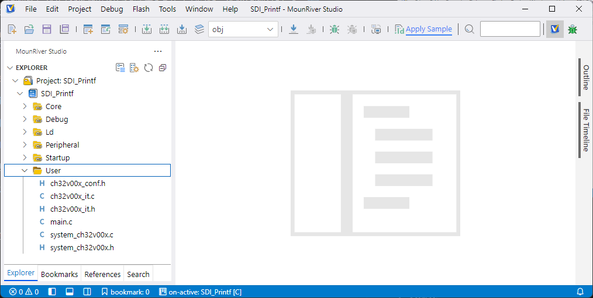

### プロジェクトの設定
プロジェクトの設定を変更します。デバッガの設定変更を行うので、WCH-LinkEを PCに接続した状態で操作します。

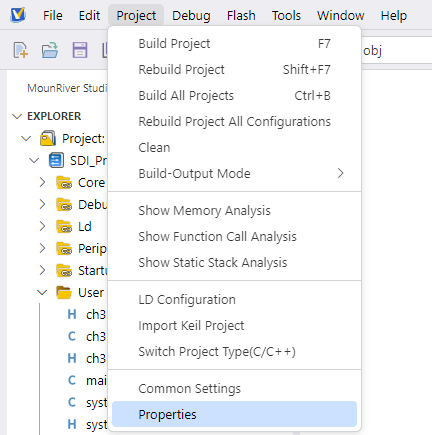

MRS2の [Project] - [Properties]でプロジェクトの設定を開く。

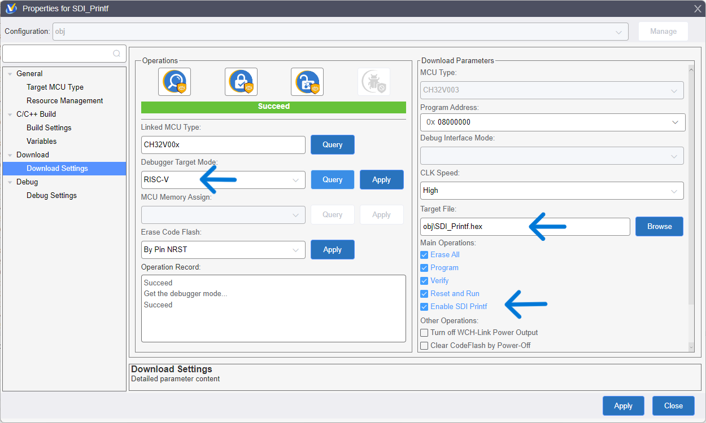

プロジェクトのプロパティの Douwload Settingsで
- Debugger Target Modeで RISC-Vを選んで、すぐ横の [Apply]ボタンを押す  
  これで、デバッガが RISC-Vモードになる

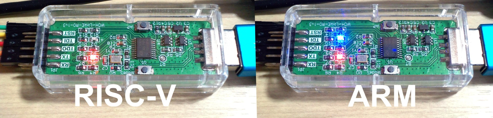  
赤LEDだけ点灯しているのが RISC-Vモード。赤LEDと青LEDが点灯しているのが ARMモード。モードは WCH-LinkEに保存されるので、この設定は最初に一度だけやればよい。購入直後はたぶん ARMモードになっています。

- Main Operationsの Enable SDI Printfにチェックを入れる
- Target File が `obj\SDI_Printf.hex`になっているか確認する  
  `obj\GPIO_Toggle.hex`になっていて、ダウンロードでエラーが出るかもしれない

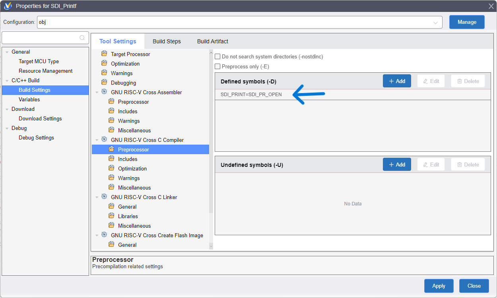

SDI_Printfを有効にるために、プロジェクトのプロパティの Build Settingsで
- GNU RISC-V Cross C Compiler - Preprosessorの Defined symbols の [+ Add]ボタンを押して `SDI_PRINT=SDI_PR_OPEN` を追加する  
  これを行わないと printfが USARTへ出力される
- 右下の Applyを押して設定を終了する

### ソースコードの編集
今回使用する開発基板には外付け水晶がありませんので、内蔵RC発振器で動作するようにサンプルのソースコードを編集する。

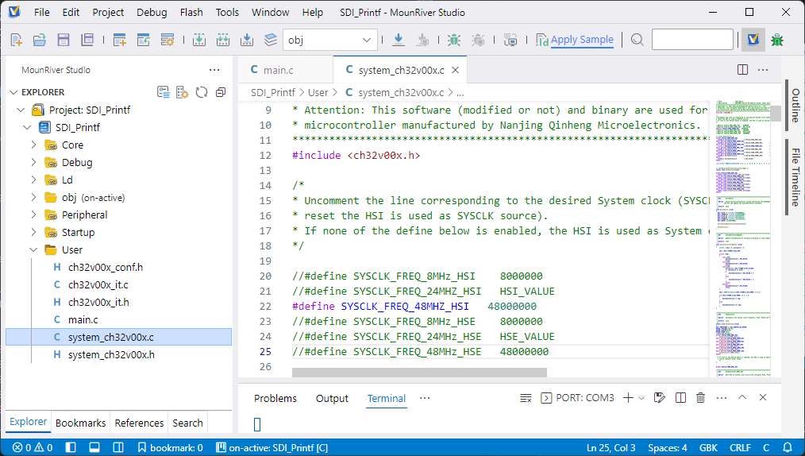

#### 発信器の設定

`user\system_ch32v00x.c` の冒頭に下のようにシステムクロックを設定する箇所があります。

```c
/* 
* Uncomment the line corresponding to the desired System clock (SYSCLK) frequency (after 
* reset the HSI is used as SYSCLK source).
* If none of the define below is enabled, the HSI is used as System clock source. 
*/

//#define SYSCLK_FREQ_8MHz_HSI    8000000
//#define SYSCLK_FREQ_24MHZ_HSI   HSI_VALUE
//#define SYSCLK_FREQ_48MHZ_HSI   48000000
//#define SYSCLK_FREQ_8MHz_HSE    8000000
//#define SYSCLK_FREQ_24MHz_HSE   HSE_VALUE
#define SYSCLK_FREQ_48MHz_HSE   48000000
```

初期状態では、外部高速水晶 48MHzが選ばれているので、

```c
//#define SYSCLK_FREQ_8MHz_HSI    8000000
//#define SYSCLK_FREQ_24MHZ_HSI   HSI_VALUE
#define SYSCLK_FREQ_48MHZ_HSI   48000000
//#define SYSCLK_FREQ_8MHz_HSE    8000000
//#define SYSCLK_FREQ_24MHz_HSE   HSE_VALUE
//#define SYSCLK_FREQ_48MHz_HSE   48000000
```

内臓高速発信器の行だけを有効にして、内臓高速RC発信器 48MHzで動作するように変更する。

### WCH-LinkEと V1772基板を接続する
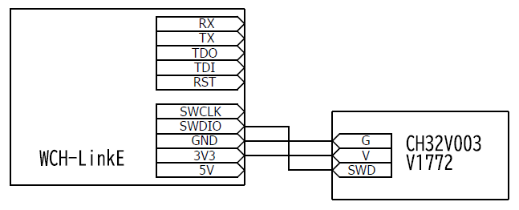
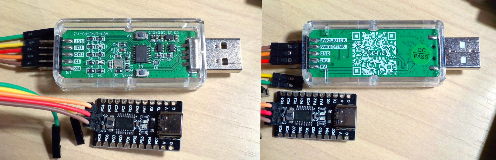

WCH-LinkEとCH32V003を電線3本で接続します。電源は5Vでも3.3Vでも、どちらでもよい。WCH-LinkEを買ったら接続用の線も付属していたので、それを使いました。

### プロジェクトのビルド - 書き込み - 実行
#### ビルド
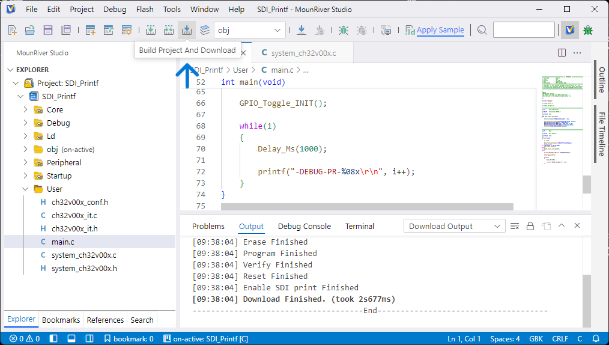
[Buld Project And Download] を押すと、プロジェクトのビルドからダウンロード（MCUへの書き込み）まで行われてプログラムが実行されます。

付近にビルド、リビルド、ダウンロードそれぞれのボタンもあります。キーボードショートカットでは ビルドが [F7]、ダウンロードが [F8]に割り当てられています。

#### 動作確認
MounRiver Studioに搭載されているシリアルターミナルを使って、出力されている文字を確認します。Tera Termなど外部のシリアルターミナルでも同じように使えます。

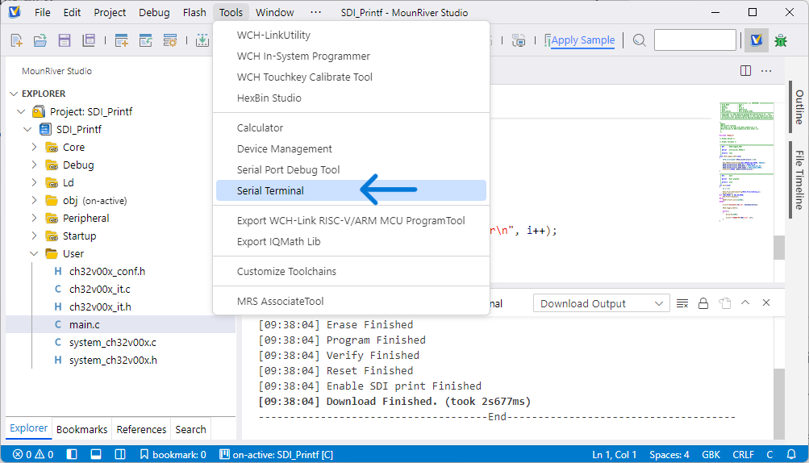
[Tools] - [Serial Terminal] を選ぶ。

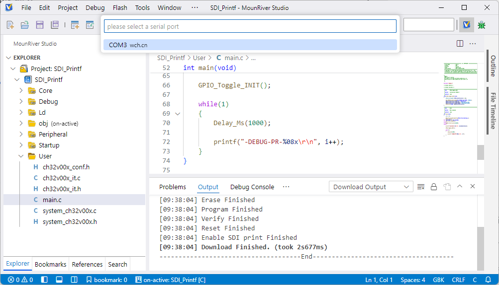
WCH-LinkEのシリアルポートを選ぶ。

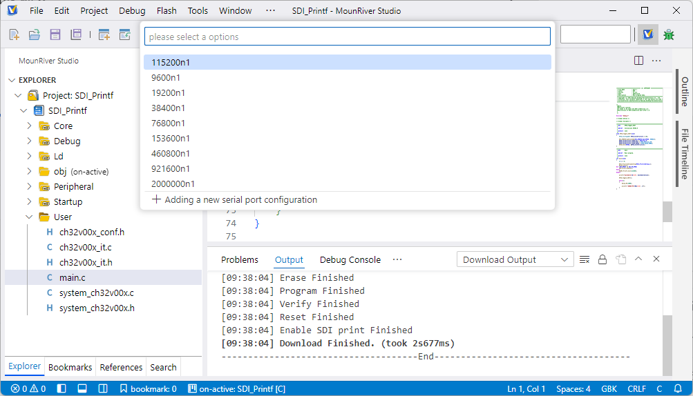
115200n1 (115200bps パリティ無し ストップビット1) を選ぶ

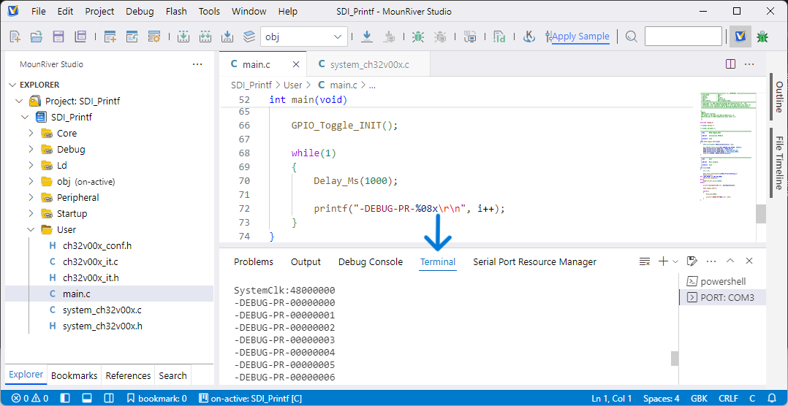
ターミナルに CH32V003が出力した文字が表示される

```c
main.c

    while(1)
    {
        Delay_Ms(1000);

        printf("-DEBUG-PR-%08x\r\n", i++);
    }
```
main.c で一秒ごとに文字を表示しているので、ターミナルにそのように表示されています。

これで、サンプルコードをビルドしてダウンロードして実行してみることができました。
### 便利機能
#### ROM / RAMの使用量を見る
メモリの使用量は、ビルドしたときに Outputのところに表示されますが、  
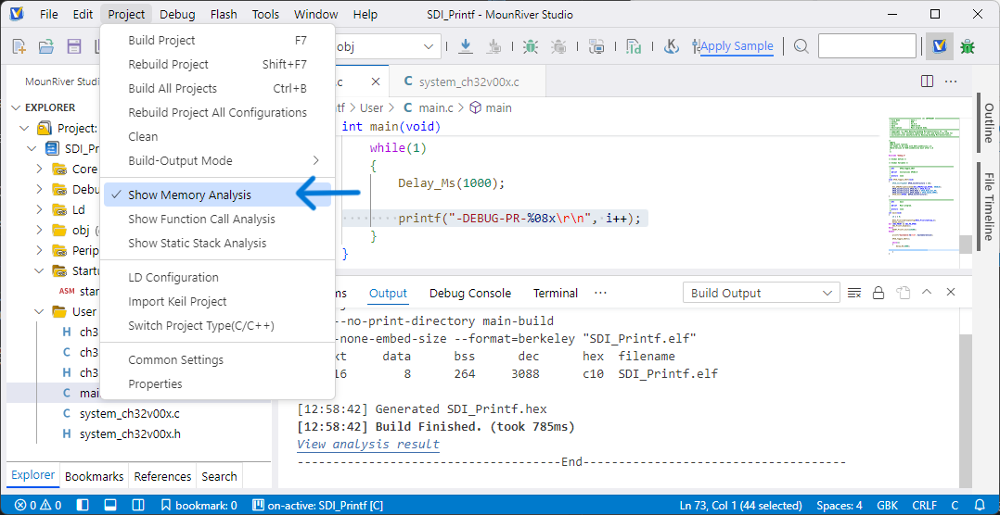  
[Project] - [Show Memory Analysis] にチェックを入れておくと、プロジェクトをビルドしたときにメモリの使用量をグラフで表示してくれます。

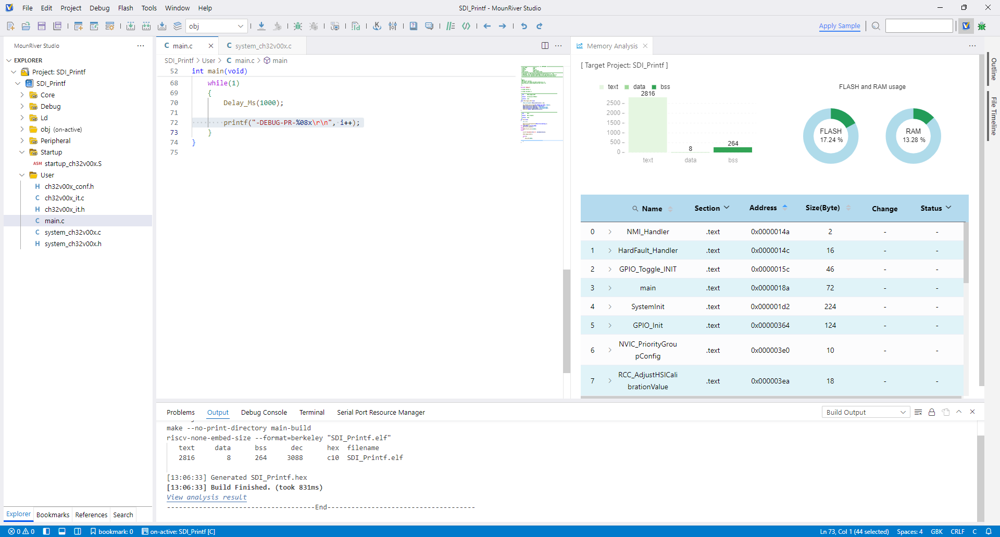  

### この文章のライセンス
[CC0 1.0 Universal](LICENSE)

2025年12月2日作成 2026年1月6日更新

[目次に戻る](index.md)
