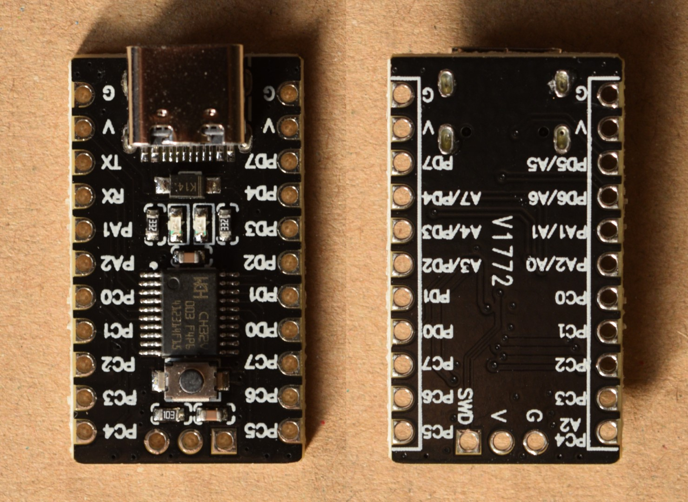

[目次に戻る](/index.md)
## V1772開発基板

Aliexpressで CH32V003の開発ボードを検索すると、裏面に V1772と書かれたものが 100円未満で売られています。外部水晶が付いていなくて使い勝手が良さそうなので買ってみました。ICのピンはすべて引き出されていて、端子の機能も印刷されていてわかりやすいのですが、回路図が無くてLEDやスイッチがどこに繋がっているのかわからなかったので、回路図を作りました。

TSSOPのハンダ付けはちょっと面倒なので、とりあえず動かしてみるのにちょうどよいですし、価格が安いのでこれをそのままユニバーサル基板に貼り付けて使っても便利です。

回路図に誤りがあるかもしれませんが、参考にしてみてください。

### 回路図

左右とも内容は同じで書き方が違うだけです。

* LEDがニ個ついていますが、電源とデバッグ信号線 (SWD / PD1) なので Lチカなどでユーザーが使うのには向きません。
* USB-Cコネクタの CCピンが無接続なので、USB-Cコネクタから電源を供給する場合は両端がUSB-Cのケーブルは使えず、片側が USB-Aのケーブルを使用します。
* USBコネクタの D+ / D- が MCUの PD5 / PD6 に接続されています。USBのデータ線に 5Vを印加するとホストが故障するかもしれないので、USBコネクタ接続時に PD5 / PD6 を出力に設定しないようにしましょう。USB-Cコネクタを UART接続に流用することを意図してこうなっているのかもしれません。PCのUSBコネクタには接続せず、ACアダプタやモバイルバッテリーから電源の供給を受けるだけにしておいた方が良い。
* PC0にタクトスイッチが接続されていて、ブートローダーに入るために使用できます。ユーザーアプリケーションでも使えます。
* PD7にコンデンサが接続されています。リセット入力に設定できるピンなのでコンデンサが接続されているのだと思います。
  
### この文章のライセンス
CC0 1.0 Universal
