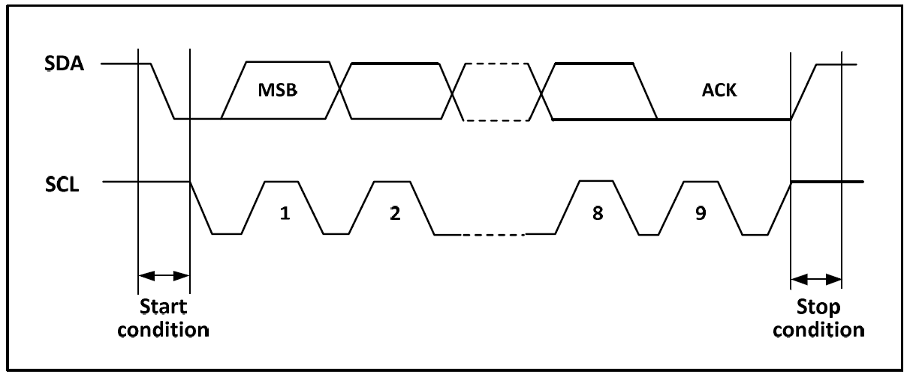
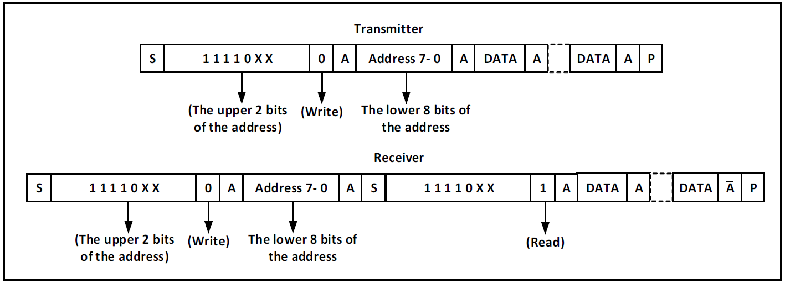
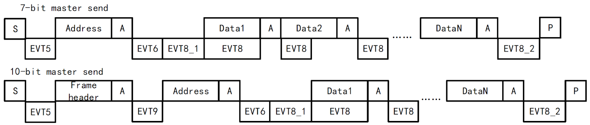
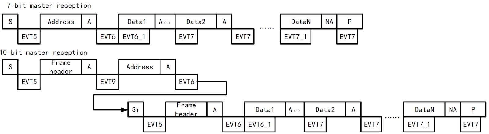
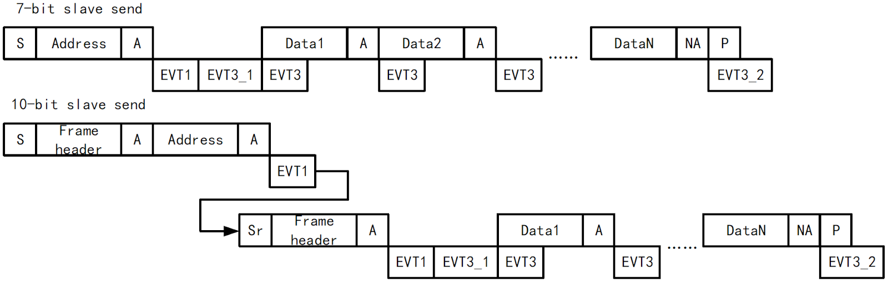
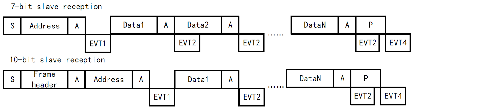
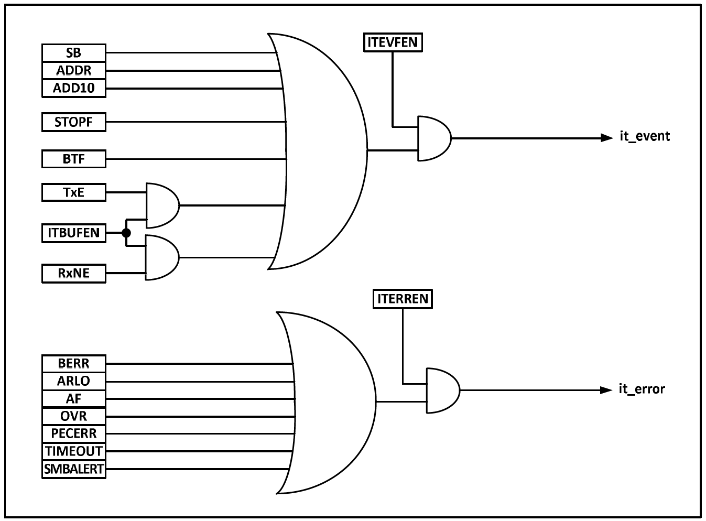

[目次に戻る](index.md)

## I2Cインターフェース
Internal Integrated Circuit Bus (I2C) は、マイクロコントローラとセンサおよびその他のオフチップモジュール間の通信に広く使用される。

マルチマスタおよびマルチスレーブモードをサポートし、SDAおよびSCLの 2本のラインのみで 100kHz（標準）および 400kHz（高速）で通信可能である。タイミング制御、DMA、CRCチェックサム機能を備える。

* マスタモードおよびスレーブモードをサポート
* 7ビットまたは 10ビットアドレスをサポート
* スレーブデバイスは 2つの 7ビットアドレスに対応
* 通信速度モード：100kHzおよび 400kHzをサポート
* 複数のステータスモードおよび複数のエラーフラグをサポート
* 拡張クロック機能をサポート
* 割り込みベクタを 2系統持つ
* DMAをサポート
* PEC (Packet Error Checking) をサポート
* SMBus互換

### 概要
I2Cは半二重バスであり、以下の 4つのモードのいずれか 1つで動作可能である。

* マスタデバイス送信モード
* マスタデバイス受信モード
* スレーブデバイス送信モード
* スレーブデバイス受信モード

I2Cモジュールはデフォルトでスレーブモードで動作し、スタートコンディションが生成されると自動的にマスタモードへ切り替わり、アービトレーションが失われた場合、またはストップコンディションが生成された場合にはスレーブモードへ戻る。

I2Cモジュールはマルチマスタ機能をサポートする。データおよびアドレスはマスタ側が送出する。データおよびアドレスはともに8ビット単位で送信され、上位ビットから先に送出される。

スタートイベントの後には、7ビットアドレスモードでは 1バイト、10ビットアドレスモードでは 2バイトのアドレスが送信される。

ホストから送信される各 8ビットのデータまたはアドレスに対して、スレーブは ACK応答を返す必要があり、ACKは SDAバスを Lowに引き下げることで示される。



正常に動作させるためには、I2Cモジュールに適切なクロックを供給する必要があり、標準モードでは最低2MHz、高速モードでは最低4MHzが必要である。

### マスタモード
マスタモードでは、マスタ側がデータ転送を制御し、クロック信号を出力する。

データ転送はスタートイベントで開始され、ストップイベントで終了する。マスタモード通信を使用する手順は以下の通りである。

* コントロールレジスタ2 CTLR2 およびクロック制御レジスタ CKCFGR に正しいクロックを設定する。
* 立ち上がりエッジレジスタ RTR に適切な立ち上がりエッジを設定する。
* コントロールレジスタ1 CTLR1 の PEビットを設定してペリフェラルを起動する。
* コントロールレジスタ1 CTLR1 のSTARTビットを設定してスタートイベントを生成する。

STARTビットを設定すると、I2Cモジュールは自動的にマスタモードへ切り替わり、MSLビットがセットされてスタートイベントが生成される。

スタートイベントが生成されると SBビットがセットされ、CTLR2の ITEVTENビットがセットされていれば割り込みが生成される。

この時点でステータスレジスタ1 STAR1 を読み出し、アドレスからデータレジスタへの書き込み後に SBビットは自動的にクリアされる。

10ビットアドレスモードを使用する場合、データレジスタにヘッダーシーケンス（11110xx0b、xxは10ビットアドレスの上位2ビット）を書き込む。ヘッダーシーケンス送信後、ステータスレジスタの ADD10ビットがセットされ、ITEVTENビットがセットされていれば割り込みが生成される。

この時点で STAR1レジスタを読み出し、2バイト目のアドレスを書き込んだ後に ADD10ビットがクリアされる。

次にデータレジスタに2バイト目のアドレスを書き込む。送信後、ステータスレジスタの ADDRビットがセットされ、ITEVTENビットがセットされていれば割り込みが生成される。この時点で STAR1レジスタ、STAR2レジスタを続けて読み出すことで ADDRビットがクリアされる。

7ビットアドレスモードの場合、データレジスタにアドレスバイトを書き込む。送信後、ステータスレジスタの ADDRビットがセットされ、ITEVTENビットがセットされていれば割り込みが生成される。この時点で STAR1レジスタ、STAR2レジスタを続けて読み出すことで ADDRビットがクリアされる。

7ビットアドレスモードでは、最初に送信されるバイトがアドレスバイトであり、上位7ビットがスレーブデバイスのアドレスを示し、8ビット目が後続メッセージの方向を決定する。0の場合はマスタデバイスがスレーブデバイスへデータを書き込み、1の場合はマスタデバイスがスレーブデバイスから情報を読み出す。

10ビットアドレスモードでは、アドレス送信フェーズにおいて最初のバイトは 11110xx0（xxは10ビットアドレスの上位2ビット）、2バイト目は下位8ビットである。その後マスタデバイス送信モードへ移行する場合はデータ送信を継続し、マスタデバイス受信モードへ移行する場合は再度スタートコンディションを送信し、続けて11110xx1のバイトを送信してマスタデバイス受信モードへ移行する。



### マスタ送信モード







### I2Cレジスタ
```c
USART1->STATR
USART1->DATAR
USART1->BRR
USART1->CTLR1
USART1->CTLR2
USART1->CTLR3
USART1->GPR
```
### この文章のライセンス
[CC0 1.0 Universal](https://github.com/KyoichiSato/ch32v003-getting-started-ja/blob/main/LICENSE)

{{page.date}}作成 {{page.updated}}更新 佐藤恭一 [kyoutan.jpn.org](https://kyoutan.jpn.org)

[目次に戻る](index.md)
