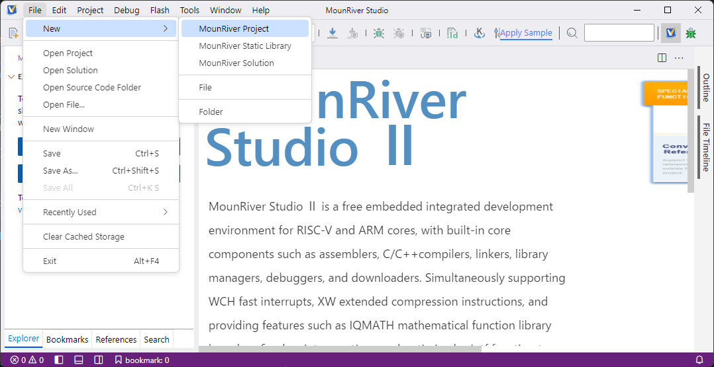
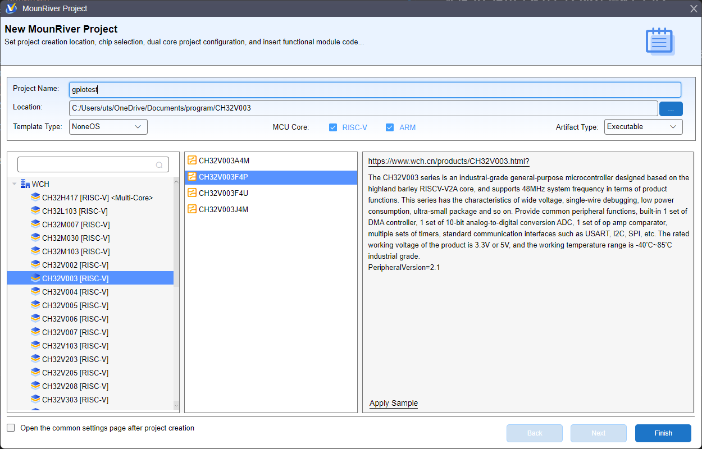
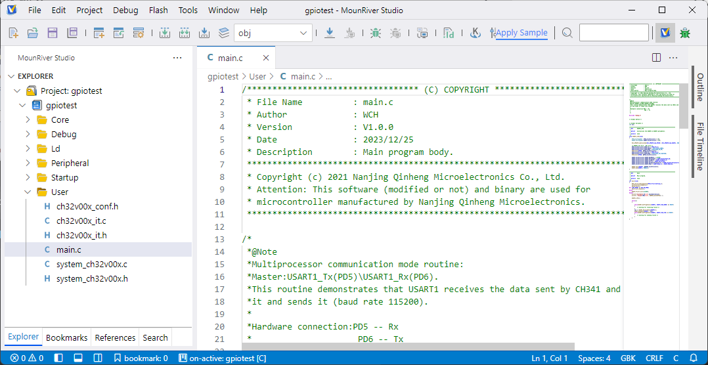
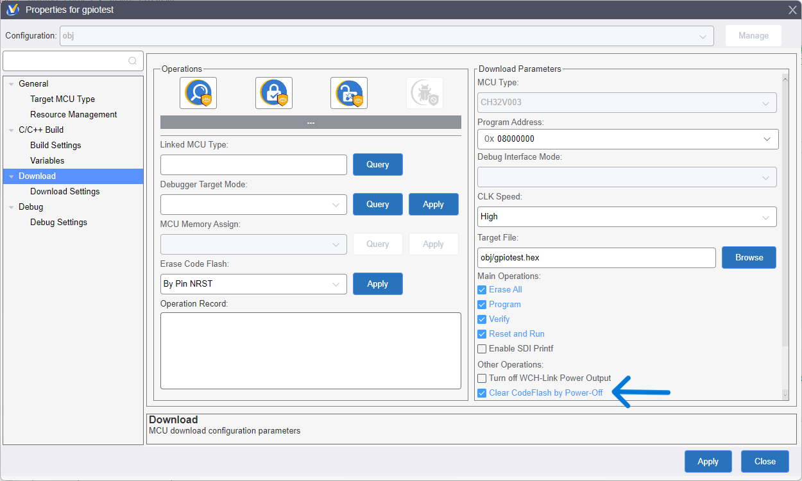

[目次に戻る](index.md)

## 新規プロジェクトを作成してGPIOを操作してみる
### 新規プロジェクトの作成
[File] - [New] - [MounRiver Project] を選択。





ダイアログで
- `CH32V003F4P` を選択
- プロジェクト名を入力
- プロジェクトの場所を選択
- [Finish] を押して完了

MCUの型番を選択するとプロジェクト名が型番と同じものに変更されるので、MCUを選択してからプロジェクト名を入力する。



これで新しいプロジェクトが作成されました。すでにこの状態でペリフェラルのライブラリもプロジェクトのディレクトリにコピーされて、すぐに使える状態になっています。

### クロックの設定
```c
User\system_ch32v00x.c

/* 
* リセット後、HSI が SYSCLK ソースとして使用される。
* 希望するシステムクロック(SYSCLK)周波数に対応する行のコメントを外すこと。
* 下記のどの定義も有効化されていない場合、HSI がシステムクロックソースとして使用される。
*/

//#define SYSCLK_FREQ_8MHz_HSI    8000000
//#define SYSCLK_FREQ_24MHZ_HSI   HSI_VALUE
#define SYSCLK_FREQ_48MHZ_HSI   48000000
//#define SYSCLK_FREQ_8MHz_HSE    8000000
//#define SYSCLK_FREQ_24MHz_HSE   HSE_VALUE
//#define SYSCLK_FREQ_48MHz_HSE   48000000
```

User\system_ch32v00x.c の冒頭部分に MCUのクロック設定があるので、ハードウェアに合わせて設定します。今回使用する開発ボードに合わせて、内蔵高速オシレータ 48MHzを選びました。

使用したい行を有効にするだけなので簡単です。

### GPIOを操作するプログラムを書く
`User\main.c` を自分で書きます。

```c
/*
    はじめて新規プロジェクトを作って GPIOを操作してみる
    V1772開発基板のPD1に接続されている赤LEDを点滅させる
*/

#include "debug.h"  // Dalay関数を使うのに必要

int main (void) {
    // スタートアッププログラムでシステムクロックが設定されてからmain関数が呼び出される

    GPIO_InitTypeDef GPIO_InitStructure = {0};              // GPIOの設定に使う構造体を定義、メンバをゼロで初期化

    NVIC_PriorityGroupConfig (NVIC_PriorityGroup_1);        // Peripheral\inc\ch32v00x_misc - 割り込みネストしない
    SystemCoreClockUpdate();                                // User\system_ch32v00x - SystemCoreClock変数を現在動作している周波数で更新する（時間の計算や通信速度の計算で使う）
                                                            // 初期化時に値がセットされているので、自分でクロックを変更していないなら必要ない
    Delay_Init();                                           // Debug\debug - Delay関数初期化 システムクロックの速度から時間に換算する準備 DalayはSysTickのコンペアマッチで動作

    RCC_APB2PeriphClockCmd (RCC_APB2Periph_GPIOD, ENABLE);  // GPIODにクロックを供給

    RCC_APB2PeriphClockCmd (RCC_APB2Periph_AFIO, ENABLE);   // AFIOにクロックを供給
    GPIO_PinRemapConfig (GPIO_Remap_SDI_Disable, ENABLE);   // PD1をユーザーが使用できるようにSDI (SWD)を無効化する
                                                            // SWDを無効化するとデバッガが接続できくなってプログラムの書き換えができなくなる。
                                                            // プロジェクトのプロパティの Downloadで **[Clear CodeFlash by Power-Off] にチェック**を入れておくと、
                                                            // ダウンロード時に毎回 MCUの電源をいったんOFFにすることで強制的にデバッガに接続して、プログラムを書き換えるようになる。

    // GPIOの設定 PD1をプッシュプル出力
    // ペリフェラルのライブラリがあるので、レジスタを直接操作しなくても設定できる
    GPIO_InitStructure.GPIO_Pin = GPIO_Pin_1;          // 設定するピンの選択

    GPIO_InitStructure.GPIO_Speed = GPIO_Speed_30MHz;  // ピンの駆動能力
                                                       // GPIO_Speed_2MHz
                                                       // GPIO_Speed_10MHz
                                                       // GPIO_Speed_30MHz が選べる
                                                       // この周波数に同期して出力するわけではなくて、駆動能力が強いと高い周波数を出力できるという意味

    GPIO_InitStructure.GPIO_Mode = GPIO_Mode_Out_PP;   // 入出力モードの選択
                                                       // GPIO_Mode_AIN         アナログ入力
                                                       // GPIO_Mode_IN_FLOATING フローティング入力
                                                       // GPIO_Mode_IPD         プルダウン入力
                                                       // GPIO_Mode_IPU         プルアップ入力
                                                       // GPIO_Mode_Out_OD      オープンドレイン出力
                                                       // GPIO_Mode_Out_PP      プッシュプル出力
                                                       // GPIO_Mode_AF_OD       代替機能オープンドレイン出力
                                                       // GPIO_Mode_AF_PP       代替機能プッシュプル出力 （AF:オルタネートファンクション USARTとかSPIとかI2Cとか）

    GPIO_Init (GPIOD, &GPIO_InitStructure);            // 上で値をセットした構造体をレジスタに書き込んで設定を行う

    // PD1に接続されているLEDを点滅させる
    while (1) {
        GPIO_SetBits (GPIOD, GPIO_Pin_1);
        Delay_Ms (500);
        GPIO_ResetBits (GPIOD, GPIO_Pin_1);
        Delay_Ms (500);
    }
}
```

### PD1 (SWD) をユーザーが使用した場合のプログラム再書き込み方法
PD1をいったんユーザーが使用するように設定してしまうと、デバッガが MCUに接続できなくなってプログラムを書き換えることができなくなってしまいます。

ですが、簡単に解消する方法があるので安心です。


プロジェクトのプロパティの Downloadで **[Clear CodeFlash by Power-Off] にチェック**を入れておくと、ダウンロード時に毎回 MCUの電源をいったんOFFにすることで強制的にデバッガに接続して、プログラムを書き換えるようになります。

WCH-LinkEの互換品では、MCUの電源 ON - OFF制御が省略されているものがあって、この機能が使えない場合があります。メーカー純正の WCH-LinkEを使ってください。

PD1をユーザーが使用すると、プログラムの書き込みができなくなって困るのではないかと心配していたのですが、使ってみるとなにも心配ありませんでした。

**[Clear CodeFlash by Power-Off] にチェックを入れておいてください。**

### この文章のライセンス
[CC0 1.0 Universal](LICENSE)

{{page.date}}作成 {{page.updated}}更新 佐藤恭一 kyoutan.jpn.org

[目次に戻る](index.md)
