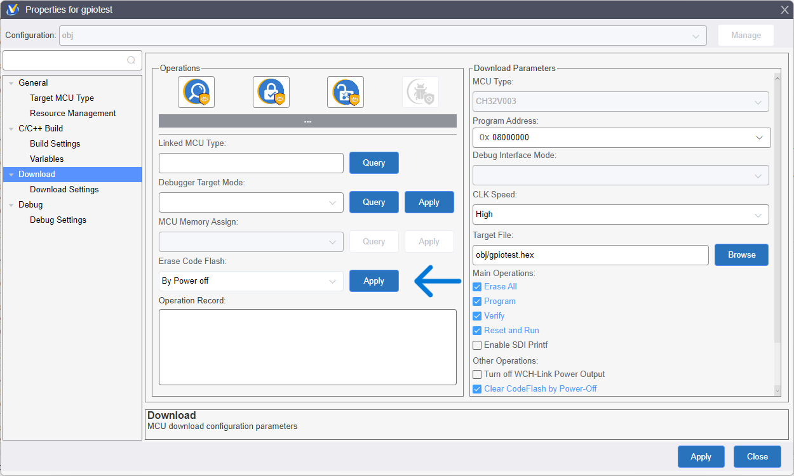

[目次に戻る](index.md)

## PD1/SWD (SDI)ピンをユーザーが使う方法
```c
    RCC_APB2PeriphClockCmd (RCC_APB2Periph_AFIO, ENABLE);  // AFIOにクロックを供給
    GPIO_PinRemapConfig (GPIO_Remap_SDI_Disable, ENABLE);  // PD1をユーザーが使用できるようにSDI (SWD)を無効化する
```
これで PD1が他のピンと同じようにユーザーが使えるようになります。

GPIOのリマップ機能で SWDピンをを解放しているのですが、AFIOにクロックを供給しなければならないことに気付かずにしばらく悩みました。

### PD1 (SWD) をユーザーが使用した場合のプログラム再書き込み方法
PD1をいったんユーザーが使用するように設定してしまうと、デバッガが MCUに接続できなくなってプログラムを書き換えることができなくなってしまいます。

ですが、簡単に解消する方法があるので安心です。

#### ユーザーの操作で都度コードフラッシュを消去する方法

プロジェクトのプロパティの Downloadで Erase Code Flashの **By Power off** を選択して、その横の [Apply]ボタンを押すと、即座にコードフラッシュが消去されて自由にデバッガで接続できるようになります。

これは WCH-LinkEから供給している MCUの電源をいったんOFFにすることで、ユーザープログラムが動作する前に強制的にデバッガに接続してコードフラッシュを消去しています。

WCH-LinkEの互換品では、MCUの電源 ON - OFF制御が省略されているものがあって、この機能が使えない場合があります。メーカー純正の WCH-LinkEを使ってください。

MCUに書き込みできなくなったときに、内容をいったん消去して別のプロジェクトに使うような場合に便利な方法です。PD1ピンをユーザーが使うプロジェクトのデバッグ時には、手間無く書き換えを行う方法が別にあるので次で説明しています。

#### 書き込み時に自動でコードフラッシュを消去する方法

プロジェクトのプロパティの Downloadで **[Clear CodeFlash by Power-Off] にチェック**を入れておくと、ダウンロード時に毎回 MCUの電源をいったんOFFにすることで強制的にデバッガに接続して、プログラムを書き換えるようになります。

PD1をユーザーが使用すると、プログラムの書き込みができなくなって困るのではないかと心配していたのですが、使ってみるとなにも心配ありませんでした。

### この文章のライセンス
[CC0 1.0 Universal](https://github.com/KyoichiSato/ch32v003-getting-started-ja/blob/main/LICENSE)

{{page.date}}作成 {{page.updated}}更新 佐藤恭一 kyoutan.jpn.org

[目次に戻る](index.md)
