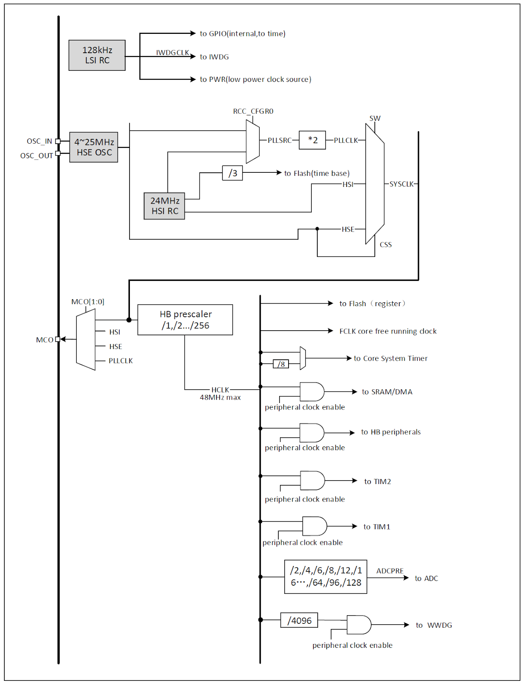

[目次に戻る](index.md)

## クロック制御 (RCC)
### システムクロック構造

図 クロックツリー CH32V003リファレンスマニュアル3章より

#### システムクロック (SYSCLK)
- HSIで動作する場合に選択できる SYSCLKは 24MHzと 48MHzのみ
- SYSCLKのソースは HSI、HSE、PLLのみ。リセット後は HSIが選択される
- CPUのクロックは SYSCLKでは無くHCLK

#### HBパス・ペリフェラルクロック (HCLK)
- CPUコアはこのクロックで動作する
- レジスタ操作で周辺モジュールを初期状態にリセット可能
- 周辺モジュールへのクロック供給を個別にオン／オフすることが可能。モジュールを使用するためには、まずクロックを供給してレジスタアクセスを可能にする必要がある

#### マイクロコントローラ・クロック出力 (MCO)
- SYSCLK、HSI、HSE、PLLCLKのいずれかを外部に出力することができる

#### クロックセキュリティシステム
- HSEクロック障害時に HSIクロックへ自動切り替えを行い、割り込みを生成してアプリケーションソフトウェアによる救済処理を可能にする

## レジスタ
`CH32V00x.h`では、RCCレジスタ群は構造体として定義されていて、各レジスタには以下のような C言語の識別子が割り当てられている。

```c
RCC->CTLR
RCC->CFGR0
RCC->INTR
RCC->APB2PRSTR
RCC->APB1PRSTR
RCC->AHBPCENR
RCC->APB2PCENR
RCC->APB1PCENR
RCC->RESERVED0
RCC->RSTSCKR
```
これらの識別子は、RCC ペリフェラルの各ハードウェアレジスタにメモリマップド I/O として対応付けられている。

```c
    RCC->CFGR0 &= (uint32_t)0xFFFEFFFF;
    RCC->INTR = 0x009F0000;
    // C言語からはこのようにレジスタを扱うことができる
```
レジスタ詳細を自分用にまとめようかと思ったのだけど、リファレンスマニュアルを直接見た方が良いのでやめた。

### この文章のライセンス
[CC0 1.0 Universal](https://github.com/KyoichiSato/ch32v003-getting-started-ja/blob/main/LICENSE)

{{page.date}}作成 {{page.updated}}更新 佐藤恭一 kyoutan.jpn.org

[目次に戻る](index.md)
