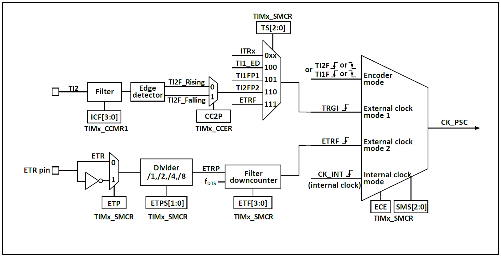
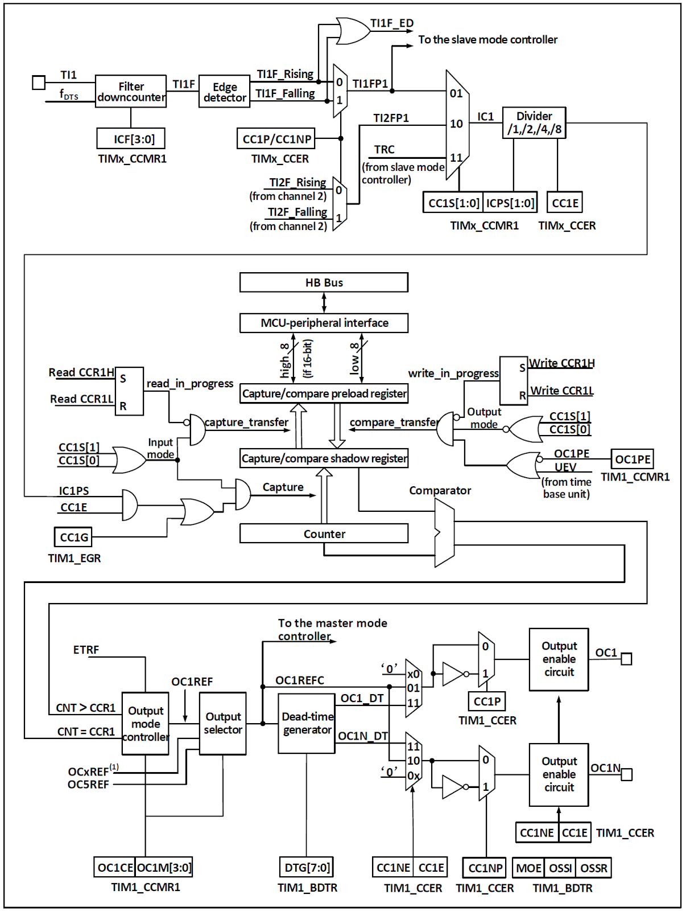
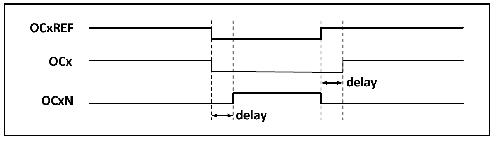
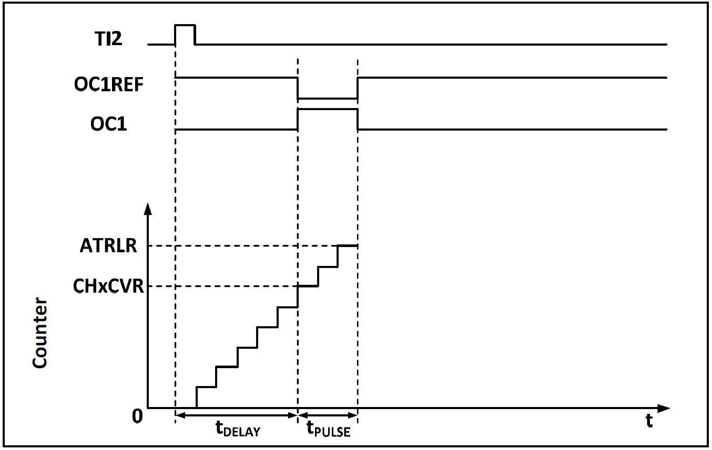

[目次に戻る](index.md)

## TIM1 アドバンスドコントロールタイマ (ADTM)
* 16bit自動リロードカウンタ 加算 / 減算 / 加算・減算 モード
* 4つのコンペア/キャプチャチャンネル
* インプットキャプチャ / コンペアマッチ出力 / PWN出力 / 単一パルス出力
* ロータリーエンコーダの読み取り
* 相補出力とプログラム可能なデッドタイム
* ブレーキ信号での停止
* タイマ間の接続

#### 用語の整理
* タイマカウンタの 1周期の完了を示す update event (UV, UEV) は、「アップデートイベント」だと何のアップデートなのか伝わらないので、この文章内では「周期完了イベント」と書く。
* タイマを外部信号やソフトウェアから停止させる機能は STM32では Breakだが、CH32V003では Brake。

### 概要
#### ブロック図


CH32V003の TIM1で使用できる入出力を以下に示す。

* ETR
* CH1
* CH2
* CH3
* CH4
* BKIN
* CH1N
* CH2N
* CH3N

ピン割り当ては AFIOで変更が可能。

#### 入力クロック
タイマは [HBバスクロック](rcc.md) (CK_INT)、外部クロック入力ピン (TIMx_ETR)、クロック出力を持つ他のタイマ (ITRx)、コンペア/キャプチャチャネルの入力 (TIMx_CHx)からクロック供給を受けることができる。これらのクロック信号は、フィルタ処理および分周処理を経て CK_PSCクロックとなり、コアカウンタ部へ出力される。

これらのクロックソースは、TRGOとして他のタイマやADCなどのペリフェラルへ出力することも可能である。

#### カウンタ CNT
タイマのコアは 16bitカウンタ (CNT) であり、入力されたクロック CK_PSCはプリスケーラ (PSC) によって分周され、CK_CNTとなって CNTへ出力される。

補助カウンタが CNTへ初期値 (ATRLR) をリロードした回数をカウントし、Repeat Count Register(RPTCR)に設定された値に達したときに周期完了イベントを発生させることができる。（周期完了イベントの間引き）

タイマは 4組のコンペア/キャプチャチャネルを有し、専用ピンからのパルス入力またはピンへの波形出力を行うことができる。各チャネルへの入力は、フィルタ処理、分周処理、エッジ検出処理をサポートし、チャネル間の相互トリガも可能であり、コアカウンタ CNTへのクロック供給源にも設定できる。

各チャンネルは、コンペア/キャプチャレジスタ(CHxCVR)を備える。

### クロック入力



入力クロック CK_PSC のクロックソースは 4種類から選択できる。

1. 内部クロックモード: CK_INT（HBクロック）
2. 外部クロックモード1: 外部クロック入力
3. 外部クロックモード2: 外部トリガ入力 ETR
4. エンコーダモード: TI1F / TI2F

#### 内部クロックモード
SMSフィールドが 000bに設定された状態でタイマを起動すると、クロックとして内部クロックソース (CK_INT) が選択される。

#### 外部クロックモード1
SMSフィールドが 111bに設定されると、外部クロックソースモード1 が有効化され、クロックとして TRGI が選択される。

TRGI のソースは TSフィールドで設定される。

1. 内部トリガ (ITRx)
2. コンペア/キャプチャチャネル1 をエッジ検出器に通した後の信号 (TI1F_ED)
3. コンペア/キャプチャチャネルの信号 TI1FP1, TI2FP2
4. 外部トリガ入力ピンからの信号 ETRF

#### 外部クロックモード2
ECEビットをセットすると、外部クロックモード2 となる。ETRFが CK_PSCとして選択され外部トリガ入力ピン信号のカウントを行う。

#### エンコーダモード
SMSを001b、010b、011bに設定すると、エンコーダモードが有効化される。エンコーダモードでは、TI1FP1 / TI2FP2を使用して外部エンコーダの出力を読み取ることができる。

### カウンタおよび周辺部


CK_PSCはプリスケーラ (PSC) に入力され、分周処理が行われる。プリスケーラは 16bitであり、実際の分周比は R16_TIMx_PSC + 1 となる。

CK_PSCは プリスケーラを通過して CK_INTとなる。

R16_TIM1_PSC の値を変更しても即時には反映されず、周期完了イベント後に PSCへ反映される。

タイマのコアは 16bitカウンタ (CNT) であり、CK_CNTクロックがカウンタへ供給される。カウンタは、加算、減算、加算・減算カウントモードをサポートする。

カウンタには自動リロードレジスタ (ATRLR) があり、各カウントサイクルの終了時に初期値をリロードする。さらに、補助カウンタがリロードの回数を記録し、Repeat Count Register (RPTCR) に設定された回数に達したときに特定のイベントを生成することが可能である。

### コンペア／キャプチャチャンネル



タイマの中核はコンペア/キャプチャレジスタであり、これに対して入力部にはデジタルフィルタ、周波数分周、チャネル間マルチプレクサが存在し、出力部にはコンパレータおよび出力制御が存在する。

信号はチャネルxピンから入力され、TIxとして構成される。TI1はフィルタ (ICF[3:0]) を通過して TI1F となり、エッジ検出器により TI1F_Rising および TI1F_Falling に分離される。これら 2つの信号は CC1P により選択され、TI1FP1 が生成される。TI1FP1 およびチャネル2 からの TI2FP1 は CC1S で選択され、IC1 になる。IC1 は ICPS による分周後、コンペア/キャプチャレジスタへ送られる。

コンペア/キャプチャレジスタは、プリロードレジスタとシャドウレジスタで構成され、読み書き処理はプリロードレジスタに対してのみ行われる。

キャプチャモードでは、キャプチャはシャドウレジスタ上で発生し、その後プリロードレジスタへコピーされる。コンペアモードでは、プリロードレジスタの内容がシャドウレジスタへコピーされ、その後シャドウレジスタの内容がコアカウンタ (CNT) と比較される。

### 機能及び実装
#### インプットキャプチャモード
外部信号が変化した（立ち上り/立ち下り）時点のカウンタ値を保存できるので、パルスの間隔を測定したり、パルス幅を測定したりすることができる。

インプットキャプチャモードの原理は、ICxPS信号の所定エッジが検出されたときにキャプチャイベントが発生し、現在のカウンタ値がコンペア/キャプチャレジスタ (CHxCVR) にラッチされることである。

キャプチャイベントが発生すると、INTFR内の CCxIFがセットされ、有効に設定されていれば、対応する割込みまたは DMAも生成される。

キャプチャイベント発生時に CCxIFがすでにセットされている場合、CCxOFビットがセットされる。CCxIFはソフトウェアによってクリア可能であり、コンペア/キャプチャレジスタの読み出しによってもハードウェアでクリアされる。CCxOFはソフトウェアによってクリアされる。（コンペア/キャプチャレジスタ CHxCVR を読み出す前に再度インプットキャプチャイベントが発生したことを検出可能）

チャネル1を例に、入力キャプチャモードの使用手順を以下に示す。

1. CC1Sフィールドを設定し、IC1信号のソースを選択する。例:10bに設定し、IC1のソースとして TI1FP1を選択する。
2. IC1Fフィールドを設定し、TI信号に対するデジタルフィルタを構成する。デジタルフィルタは所定の周波数で所定回数サンプリングを行い、信号の変化を出力する。このサンプリング周波数および回数は IC1Fによって決定される。
3. CC1Pビットを設定し、TI1FP1の有効エッジを構成する。
4. IC1PSCフィールドを設定し、IC1信号のプリスケーラを構成する。例：IC1PSCを 00bに設定し、プリスケーラなしとする。
5. CC1Eビットを設定し、コアカウンタ (CNT) の値をコンペア/キャプチャレジスタにキャプチャ可能とする。
6. 必要に応じて CC1IEおよび CC1DEビットを設定し、割込みまたは DMAの有効化を構成する。これによりコンペアキャプチャチャネルの構成が完了する。

TI1にキャプチャパルスが入力されると、コアカウンタ (CNT) の値がコンペア/キャプチャレジスタに記録され、CC1IFがセットされる。CC1IFがすでにセットされている場合、CCIOFビットがセットされる。

CC1IEビットがセットされていれば割込みが生成され、CC1DEビットがセットされていればDMA要求が生成される。

入力キャプチャイベントは、イベント生成レジスタ (TIMx_SWEVGR) への書き込みによってソフトウェア的に生成することも可能である。

#### コンペア出力モード
コンペア出力モードの原理は、コアカウンタ (CNT) の値がコンペアキャプチャレジスタの値と一致したときに、特定の変化または波形を出力することである。

出力が、固定、High/Lowレベル、レベル反転かは、CHCTLRx内の OCxMフィールドおよび CCER内の CCxPビットによって決定される。

コンペアマッチイベントが発生すると、CCxIFビットもセットされる。CCxIEビットが事前にセットされていれば割込みが生成され、CCxDEビットが事前にセットされていればDMA要求が生成される。

コンペアマッチ出力モードの構成手順は以下のとおりである。

1. コアカウンタ (CNT) のクロックソースおよび自動リロード値を構成する。
2. 比較対象のカウント値をコンペアキャプチャレジスタ (CHxCVR) に設定する。
3. 割込みを生成する必要がある場合、CCxIEビットをセットする。
4. コンペアレジスタのプリロードレジスタを無効にするため、OCxPEを0に保持する。
5. 出力モードを設定するため、OCxMフィールドおよび CCxPビットを構成する。
6. 出力を有効化するため、CCxEビットをセットする。
7. タイマを起動するため、CENビットをセットする。

#### 強制出力モード
コンペアキャプチャチャネルの出力パターンは、コンペアキャプチャレジスタとコアカウンタとの比較に依存せず、ソフトウェアによって所定のレベルに強制出力することが可能である。

これは、OCxMを 100bに設定することで出力を Lowに強制、または OCxMを101bに設定することで出力を Highに強制することで実現される。

なお、OCxMを100bまたは101bに強制設定した場合でも、内部コアカウンタとコンペアキャプチャレジスタによる比較処理は継続して行われ、対応するフラグは引き続きセットされ、割込みおよびDMA要求も生成される。

#### PWM入力モード
PWM入力モードは、PWMのデューティ比および周波数を測定するために使用される入力キャプチャモードの特殊ケースである。動作は入力キャプチャモードと同様であるが、以下の点が異なる。

PWMは 2つのコンペアキャプチャチャネルを占有し、両チャネルの入力極性は反対に設定される。1つの信号はトリガ入力として設定され、SMSはリセットモードに設定される。

例として、TI1から入力されるPWM波の周期および周波数を測定するには、以下の操作が必要である。

1. TI1 (TI1FP1) を IC1信号の入力として設定する。CC1Sを 01bに設定する。
2. TI1FP1を立上りエッジ有効に設定する。CC1Pを 0に設定する。
3. TI1 (TI1FP2) を IC2信号の入力として設定する。CC2Sを 10bに設定する。
4. TI1FP2を立下りエッジ有効に設定する。CC2Pを 1に設定する。
5. TI1FP1をカウンタリセット用トリガ入力として選択する。TSを 101bに設定する。
6. SMSをリセットモード、すなわち 100bに設定する。このモードではカウントクロックに内部クロックが使用される。
7. 入力キャプチャを有効化する。CC1Eおよび CC2Eをセットする。

これにより、コンペアキャプチャレジスタ1の値が PWMの周期となり、コンペアキャプチャレジスタ2の値が PWMのデューティ比となる。

備考：TI1FP1および TI2FP2のみがスレーブモードコントローラに接続されているため、PWM入力モードはTIM1_CH1 / TIM1_CH2でのみ使用可能である。

#### PWM出力モード
PWM出力モードは、リロード値によって PWM周波数を決定し、コンペアキャプチャレジスタによってデューティ比を決定する用途で最も一般的に使用される。

PWMモード1 またはモード2 を使用するには、OCxMフィールドに 110bまたは 111bを設定する。

OCxPEビットをセットしてコンペアレジスタのプリロードレジスタを有効化し、ARPEビットをセットしてプリロードレジスタの自動リロードを有効化する。

プリロードレジスタの値は周期完了イベントが発生したときのみシャドウレジスタへ転送されるため、コアカウンタのカウント開始前にUGビットをセットして全レジスタを初期化する必要がある。

PWMモードでは、コアカウンタとコンペアキャプチャレジスタの比較を行い、タイマは CMSビットの設定に応じて、エッジアラインまたはセンターアラインの PWM信号を出力する。

##### エッジアライン
エッジアラインでは、コアカウンタは加算または減算どちらかで使用される。

PWMモード1 では、コアカウンタの値がコンペアキャプチャレジスタより小さいとき出力は Highとなり、それ以外は Lowとなる（アップカウント時）。

##### センターアライン
センターアラインモードでは、コアカウンタは加算と減算を交互に実行し、コアカウンタの値とコンペアキャプチャレジスタの値が一致したときに、出力が変化する。ただし、3種類のセンターアラインモードにおいては、コンペアフラグがセットされるタイミングがそれぞれ異なる。

センターアラインモードを使用する際は、コアカウンタの起動前にソフトウェアで更新フラグ（UGビット）を生成し、出力を初期化することが推奨される。

#### 相補出力及びデッドタイム挿入 (TIM1のみ)
##### 相補出力
コンペアキャプチャチャネルは 2つの出力ピン（ただしチャネル4は 1つのみ）を持ち、2つの相補信号 (OCx, OCxN) を出力可能である。

OCxおよび OCxNは、極性 をCCxPおよび CCxNPビットで個別に設定でき、出力有効化は CCxEおよび CCxNEビットで個別に制御可能である。

また、デッドタイムおよびその他の制御については、MOE, OIS, OISN, OSSI, OSSRビットによって個別に設定可能である。

##### デッドタイム挿入
OCxおよび OCxNの出力を同時に有効化すると、デッドタイムが挿入される。

各チャネルには 10bitのデッドタイムジェネレータが搭載されていて、相補出力端子間に遅延を挿入する。

タイマ出力端子 OCxおよび OCxNは OCxREF（コンペア出力信号）に基づいて生成される。

出力の設定ががアクティブHI である場合、OCxの立下りは OCxREFと同一であるが、OCxの立上りは OCxREFに対して遅延する。また、OCxNは OCxREFの反転信号であり、その立上りエッジは OCxREFの立下りエッジに対して遅延する。

この遅延が有効出力幅よりも大きい場合、対応するパルスは出力されない。



#### ブレーキ信号 (TIM1のみ)
ブレーキイベントが発生すると、

- MOE（メイン出力有効化）
- OIS / OISN（出力アイドル状態の選択）
- OSSI（カウンタ停止中ブレーキでの出力状態）
- OSSR（タイマ動作中ブレーキでの出力状態）

ビットに従って出力端子の状態が変更される。ブレーキイベントで停止中は、OCxおよび OCxNがアクティブレベルにはならず、事前設定に従ってアイドル状態か出力されるか出力無効となる。

（出力無効状態は、非アクティブ状態のことで、HI-Zではない。あとで実物で確認する。CCxPで アクティブHI/アクティブLO を選択できる）

ブレーキイベントのソースには、ブレーキ入力ピンからの信号、CSS（クロックセーフティシステム）によって生成されるクロック障害イベント、SWEVGRレジスタへの書き込みがある。

システムリセット後、タイマ出力はデフォルトで無効（MOE = 0）となっており、ブレーキ機能も無効である。BKEビットを設定することでブレーキ機能が有効化される。

入力されるブレーキ信号の極性は BKPビットで設定可能であり、BKEおよび BKP信号は同時に書き込み可能である。ただし、実際の書き込みには 1HBクロックの遅延があるため、正しく読み取るには 1HBサイクル待機する必要がある。

ブレーキピンに選択されたレベルが入力されると、システムは以下の動作を行う。

1. MOEビットが非同期にクリアされ、OSSR / OSSIビットの設定に応じて、無効またはアイドル状態 (OIS / OISN) が出力される。
2. 補完出力を使用している場合でも、同様に無効状態かアイドル状態を出力する。
3. BIEビットが設定されている場合、割込みが生成される。BDEビットが設定されている場合、DMA要求が生成される。
4. AOEビットが設定されている場合、次の周期完了イベント（UEV）でMOEビットが自動的にセットされタイマ出力が有効になる。この時ブレーキ入力が有効のままであれば MOEがリセットされ、出力は安全レベルに保たれ続ける。

#### ワンショットパルスモード
ワンショットパルスモードは、特定のイベントの後、あらかじめ設定した遅延後にパルスを生成するモードである。パルスの遅延時間および幅はプログラム可能である。

OPMビットを設定することでワンショットパルスモードとなり、次の周期完了イベント (UEV) が生成された際（カウンタが0に戻るタイミング）にコアカウンタの動作を停止させることができる。

例: 次の図のように TI2入力ピンで立上りエッジが検出された直後に、遅延時間Tdelayを経て、OC1上に長さTpulseの正パルスを生成する。



1. TI2をトリガとして設定する。
   - CC2Sフィールドを 01bに設定し、TI2FP2を TI2に割り当てる。
   - CC2Pビットを 0bに設定し、TI2FP2を立上りエッジ検出に構成する。
   - TSフィールドを 110bに設定し、TI2FP2をトリガソースとして指定する。
   - SMSフィールドを 110bに設定し、TI2FP2をカウンタ起動ソースとして使用する。
2. Tdelayはコンペアキャプチャレジスタ (CH1CVR) の値によって決定され、Tpulseはオートリロード値レジスタ ATRLR およびコンペアキャプチャレジスタ (ATRLR - CH1CVR) の値によって決定される。

#### エンコーダモード
エンコーダモードは、ロータリーエンコーダの 2相出力を取り込むために使用される。

コアカウンタのカウント方向はエンコーダの回転軸の方向と同期し、エンコーダから出力される各パルスにより、コアカウンタは 1加算または 1減算される。

エンコーダを使用するには、SMSフィールドを以下のいずれかに設定する。

- 001b:TI2エッジのみでカウント
- 010b:TI1エッジのみでカウント
- 011b:TI1および TI2両エッジでカウント

また、エンコーダをコンペアキャプチャチャネル1 およびチャンネル2 の入力に接続する。

エンコーダモードで周期更新イベントが発生するのは避けたいので、リロード値レジスタを 0xFFFF、タイマカウンタを 0x8000などに設定する。

エンコーダモードでは、タイマ内部のコンペアキャプチャレジスタ、プリスケーラ、リピートカウントレジスタなどは通常通り動作する。

カウント方向とエンコーダ信号の関係を次に示す。

```
エンコーダモード1
TI1FP1 __+---+__________+---+__
TI2FP2 ____+---+______+---+____
         | | | |      | | | |
         | | | + 加算 | | | + 不変
         | | + 不変   | | + 減算
         | + 加算     | + 不変
         + 不変       + 減算

エンコーダモード2
TI1FP1 __+---+__________+---+__
TI2FP2 ____+---+______+---+____
         | | | |      | | | |
         | | | + 不変 | | | + 減算
         | | + 加算   | | + 不変
         | + 不変     | + 減算
         + 加算       + 不変

エンコーダモード3
TI1FP1 __+---+__________+---+__
TI2FP2 ____+---+______+---+____
         | | | |      | | | |
         | | | + 加算 | | | + 減算
         | | + 加算   | | + 減算
         | + 加算     | + 減算
         + 加算       + 減算

エンコーダモード3 が普通のロータリーエンコーダに対応
```
#### タイマ同期モード
タイマはクロックパルス（TRGO）の出力が可能であり、他のタイマからの入力（ITRx）を受け取ることもできる。

ITRxのソース（他のタイマからのTRGO）は、タイマごとに異なる。タイマ内部のトリガ接続関係を次に示す。

|従属  |ITR0 (TS=000)|ITR1 (TS=001)|ITR2 (TS=010)|ITR3 (TS=011)|
|------|-------------|-------------|-------------|-------------|
|TIM1  |             |TIM2         |             |             |
|TIM2  |TIM1         |             |             |             |

使用できるのは他のタイマの出力 (TRGO) だけである。

### TIM1レジスタ
```c
TIM1->CTLR1
TIM1->CTLR2
TIM1->SMCFGR
TIM1->DMAINTENR
TIM1->INTFR
TIM1->SWEVGR
TIM1->CHCTLR1
TIM1->CHCTLR2
TIM1->CCER
TIM1->CNT
TIM1->PSC
TIM1->ATRLR
TIM1->RPTCR
TIM1->CH1CVR
TIM1->CH2CVR
TIM1->CH3CVR
TIM1->CH4CVR
TIM1->BDTR
TIM1->DMACFGR
TIM1->DMAADR
```
```
CTLR1 コントロールレジスタ1 初期値 0x0000
[   15] CAPLVL   RW ダブルエッジキャプチャでキャプチャ時の信号レベルを記録する 1:有効
                    （CHxCVRの bit16にキャプチャ時の信号レベルが記録される）
[   14] CAPOV    RW キャプチャ値モード 
                    0:オーバーフローしてもキャプチャ時のカウンタ値を記録する
                    1:キャプチャ前にカウンタがオーバフローした場合 0xffffが記録される
[13:10]          RO Reserved
[ 9: 8] CKD[1:0] RW タイマクロック分周比 デッドタイムとデジタルフィルタ (ETR, TIx) で使用される
                    00:Tdts=Tck_int    10:Tdts=Tck_int*4
                    01:Tdts=Tck_int*2  11:設定不可
                    Tck_int:RCCからの供給クロック (HCLK)
[    7] ARPE     RW オートリロード有効化 1:有効 （リロード値 ATRLR）
[ 6: 5] CMS[1:0] RW アライメントモード選択
                    00:エッジアライメントモード カウント方向ビット (DIR) に基づいてカウントする
                    01:中央アライメントモード1 加算->減算カウントを行う
                       コンペアマッチは減算時のみ発生する
                    10:中央アライメントモード2 加算->減算カウントを行う
                       コンペアマッチは加算時のみ発生する
                    11:中央アライメントモード3 加算->減算カウントを行う
                       コンペアマッチは加算時、減算時両方で発生する
                    CEN=1の時にはエッジアライメント-中央アライメントの変更はできない
[    4] DIR      RW カウント方法 0:加算カウント 1:減算カウント
[    3] OPM      RW ワンショットパルスモード
                    0:周期完了（アップデート）イベント (UEV) で停止せず動作を継続する
                    1:周期完了（アップデート）イベント (UEV) が発生すると動作を停止する (CENがクリアされる)
[    2] URS      RW 周期完了（アップデート）イベント要因選択
                    0:カウンタのオーバーフロー/アンダーフロー
                      SWEVGRの UG （リセット）
                      スレーブモード制御による更新
                    1:カウンタのオーバーフロー/アンダーフロー
[    1] UDIS     RW 更新イベント無効化
                    0:許可
                    1:無効
[    0] CEN      RW カウンタ有効 1:有効化
                    トリガモードでは、ハードウェアでセットされる。
```
```
CTLR2 コントロールレジスタ2 初期値 0x0000
[   15]          RO Reserved
[   14] OIS4     RW 出力アイドル状態4  設定
                    0:アイドル状態の OC4=0
                    1:アイドル状態の OC4=1
                    タイマが停止しているときの出力状態を設定
                    ブレーキ信号で停止した状態の出力は、BDTRで出力無効かアイドル状態を出力するかを選択可能
[   13] OIS3N    RW 出力アイドル状態3N 設定
                    0:アイドル状態の OC3N=0
                    1:アイドル状態の OC3N=1
[   12] OIS3     RW 出力アイドル状態3  設定
[   11] OIS2N    RW 出力アイドル状態2N 設定
[   10] OIS2     RW 出力アイドル状態2  設定
[    9] OIS1N    RW 出力アイドル状態1N 設定
[    8] OIS1     RW 出力アイドル状態1  設定
[    7] TI1S     RW TI1入力選択
                    0:TIMx_CH1
                    1:TIMx_CH1, TIMx_CH2, TIMx_CH3 の XOR
[ 6: 4] MMS[2:0] RW マスタモード選択
                    スレーブタイマへ送信される同期出力 (TRGO) を選択する。
                    000:SWEVGRの UG （リセット）
                    001:CTLR1の CEN （タイマの起動）
                    010:周期完了（アップデート）イベント
                    011:CCxIF（キャプチャ/コンペアマッチの発生）
                    100:OC1REF（CH1のコンペアマッチ）
                    101:OC2REF
                    110:OC3REF
                    111:OC4REF
[    3] CCDS     RW インプットキャプチャ DMA要求要因選択
                    0:インプットキャプチャ発生で CHxCVR （データレジスタ）の DMA要求
                    1:更新イベントで CHxCVRの DMA要求
[    2] CCUS     RW コンペアマッチ設定値 (CCR) 更新タイミング選択
                    0:更新イベントで更新（COMが存在しないため）
                    1:更新イベントで更新
                    CH32V003に COMビットは存在しない
[    1]          RO Reserved
[    0] CCPC     RW コンペアマッチプリロード制御
                    0:CCRは書き込み即反映
                    1:更新イベントでCCRを更新
                    波形出力で CCRの更新を更新イベント（タイマの1周期完了）
                    のタイミングで行うことで、出力波形の乱れを防ぐ機能
```
```
SMCFGR スレーブモードコントロールレジスタ 初期値 0x0000
[   15] ETP       RW ETR（外部トリガ）極性選択
                     0:立ち上がりエッジでアクティブ
                     1:立ち下がりエッジでアクティブ
[   14] ECE       RW 外部クロックモード2 有効化 1:有効
                     備考1:外部クロックモード2と同時にスレーブモードを使用することが可能。
                     ただし TRGIを ETRFに接続することはできない（TSビットに '111' を設定することは不可）
                     備考2:外部クロックモード1と外部クロックモード2の両方が有効化されている場合、外部クロック入力は ETRF に固定される
[13:12] ETPS[1:0] RW 外部トリガプリスケーラ
                     00:ETR    10:ETR/4
                     01:ETR/2  11:ETR/8
                     プリスケーラの出力 ETRPの周波数は CK_INTの 1/4を超えてはならない。
[11: 8] ETF[3:0]  RW 外部トリガフィルタ設定
                     N回連続で入力信号が同じなら、信号有効とするフィルタ
                     0000:フィルタなし   1000:Fdts/ 8, N=6
                     0001:Fck_int, N=2  1001:Fdts/ 8, N=8
                     0010:Fck_int, N=4  1010:Fdts/16, N=5
                     0011:Fck_int, N=8  1011:Fdts/16, N=6
                     0100:Fdts/ 2, N=6  1100:Fdts/16, N=8
                     0101:Fdts/ 2, N=8  1101:Fdts/32, N=5
                     0110:Fdts/ 4, N=6  1110:Fdts/32, N=6
                     0111:Fdts/ 4, N=8  1111:Fdts/32, N=8
                     Fck_int=RCCからTIM1に供給されるクロック (HCLK)
                     Fdts=CTLR1の CKDで設定したクロック
[    7] MSM       RW マスタ/スレーブモード有効
                     0:無効 マスタのゲートによりこのタイマのトリガ入力 (TRGI) が遅延する
                     1:有効 マスタのトリガ発生と、このタイマのトリガ入力が同期する
[ 6: 4] TS[2:0]   RW トリガ選択
                     000:内部トリガ (ITR0)  100:TI1のエッジ検出器 (TI1F_ED)
                     001:内部トリガ (ITR1)  101:フィルタ処理されたタイマ入力1 (TI1FP1)
                     010:内部トリガ (ITR2)  110:フィルタ処理されたタイマ入力2 (TI1FP2)
                     011:内部トリガ (ITR3)  111:外部トリガ入力 (ETRF)
                     SMSが 0の場合のみ変更可能
[    3]           RO Reserved
[ 2: 0] SMS[2:0]  RW 入力モード選択
                     000:内部クロック (CK_INT) で動作 スレーブ動作無効
                     001:エンコーダモード1 TI2FP2のエッジでカウント
                     010:エンコーダモード2 TI1FP1のエッジでカウント
                     011:エンコーダモード3 TI1FP1, TI2FP2の両エッジでカウントし、エッジを検出しなかった端子のレベルにより増減方向が変化（普通のロータリーエンコーダがこれ）
                     100:リセットモード トリガ入力(TRGI)の立ち上がりでカウンタを 0にする
                         カウントは内部クロックが使用される
                     101:ゲートモード TRGIが HIの期間をカウントする
                     110:トリガモード TRGIの立ち上がりでカウントを開始する
                     111:外部クロックモード1 TRGIの立ち上がりをカウントする
```
エンコーダモードの信号は [エンコーダモード](#エンコーダモード-1)の説明を参照

```
DMAINTENR DMA/割り込み 有効化レジスタ 初期値 0x0000
[   15]       RO Reserved
[   14] TDE   RW トリガDMA有効化 1:有効
[   13] COMDE RW 未実装 （COMのDMA有効化）
[   12] CC4DE RW コンペア/キャプチャ CH4 DMA有効化
[   11] CC3DE RW コンペア/キャプチャ CH3 DMA有効化
[   10] CC2DE RW コンペア/キャプチャ CH2 DMA有効化
[    9] CC1DE RW コンペア/キャプチャ CH1 DMA有効化
[    8] UDE   RW 周期完了（アップデート）イベントDMA有効化
[    7] BIE   RW ブレーキ割り込み有効化
[    6] TIE   RW トリガ割り込み有効化
[    5] COMIE RW 未実装 （COM割り込み有効化）
[    4] CC4IE RW コンペア/キャプチャ CH4 割り込み有効化
[    3] CC3IE RW コンペア/キャプチャ CH3 割り込み有効化
[    2] CC2IE RW コンペア/キャプチャ CH2 割り込み有効化
[    1] CC1IE RW コンペア/キャプチャ CH1 割り込み有効化
[    0] UIE   RW 周期完了（アップデート）イベント割り込み有効化
```
```
INTFR 割り込みステータスレジスタ 初期値 0x0000
[15:13]       RO  Reserved
[   12] CC4OF RW0 インプットキャプチャ CH4 オーバーキャプチャフラグ
                  1:キャプチャ値を読み取る前に次のインプットキャプチャが発生した
[   11] CC3OF RW0 インプットキャプチャ CH3 オーバーキャプチャフラグ
[   10] CC2OF RW0 インプットキャプチャ CH2 オーバーキャプチャフラグ
[    9] CC1OF RW0 インプットキャプチャ CH1 オーバーキャプチャフラグ
[    8]       RO  Reserved
[    7] BIF   RW0 ブレーキ割り込みフラグ
[    6] TIF   RW0 トリガ割り込みフラグ
[    5] COMIF RW0 未実装（COM割り込みフラグ）
[    4] CC4IF RW0 コンペア/キャプチャ CH4 割り込みフラグ
[    3] CC3IF RW0 コンペア/キャプチャ CH3 割り込みフラグ
[    2] CC2IF RW0 コンペア/キャプチャ CH2 割り込みフラグ
[    1] CC1IF RW0 コンペア/キャプチャ CH1 割り込みフラグ
[    0] UIF   RW0 周期完了（アップデート）割り込みフラグ
RW0:ハードウエアによってセットされ、0書き込みでクリアされる
CCxOFはインプットキャプチャモードでのみ有効
```
```
SWEVGR イベント生成レジスタ 初期値 0x0000
[15: 8]      RO Reserved
[    7] BG   WO ブレーキイベント生成
[    6] TG   WO トリガイベント生成
[    5] COMG WO 未実装（COMイベント生成）
[    4] CC4G WO コンペア/キャプチャイベント4 生成
[    3] CC3G WO コンペア/キャプチャイベント3 生成
[    2] CC2G WO コンペア/キャプチャイベント2 生成
[    1] CC1G WO コンペア/キャプチャイベント1 生成
[    0] UG   WO 周期完了（アップデート）イベント生成
外部端子やカウンタ一致で発生するイベントを、ソフトウェアで強制的に発生させるためのレジスタ
1を書くとイベント生成
```
```
CHCTLR1 コンペア/キャプチャコントロールレジスタ1 初期値 0x0000
コンペアマッチ出力モード
[   15] OC2CE     RW コンペア/キャプチャCH2 クリア設定
                     1:外部トリガ入力 (ETRF) が HI で コンペア出力2 (OC2REF) を 0 にする
[14:12] OC2M      RW コンペア出力信号2 (OC2REF) 動作設定 
                     000:信号出力なし
                     001:コンペアマッチで 1 を出力
                     010:コンペアマッチで 0 を出力
                     011:コンペアマッチで出力を反転
                     100:常に 0 を出力
                     101:常に 1 を出力
                     110:PWMモード1 アップカウント時、CNT < CVR で 1出力, それ以外 0出力
                                    ダウンカウント時、CNT > CVR で 0出力, それ以外 1出力
                     111:PWMモード2 アップカウント時、CNT < CVR で 0出力, それ以外 1出力
                                    ダウンカウント時、CNT > CVR で 1出力, それ以外 0出力
[   11] OC2PE     RW コンペア/キャプチャレジスタ2 (CH2CVR) プリロード有効化
                     1:レジスタ更新後次の周期完了（アップデート）イベントでレジスタ反映
                     0:レジスタ更新即反映
                     CH2CVR書き込みタイミングによって、一周期の中で信号が複数回変化したり全く変化しないことがないように、レジスタ値の反映を周期完了時に限定する機能。
[   10] OC2FE     RW コンペア/キャプチャCH2 高速応答有効化
                     0:無効 出力最小遅延 5クロック 1:有効 出力最小遅延 3クロック
                     フィルタを無効化するか何かで応答を高速化する
                     PWMモード1かPWMモード2でのみ有効
[ 9: 8] CC2S[1:0] RW コンペア/キャプチャCH2 入出力選択
                     00:出力
                     01:TI2ピン入力
                     10:TI1ピン入力
                     11:トリガコントローラから入力 (TRC)
                        SMCFGRの TSで内部トリガ入力が選択されている場合のみ
                     コンペアマッチ出力モードでは 00を設定する
[    7] OC1CE     RW コンペア/キャプチャCH1 クリア設定
[ 6: 4] OC1M      RW コンペア出力信号1 (OC1REF) 動作設定 
[    3] OC1PE     RW コンペア/キャプチャレジスタ1 (CH2CVR) プリロード有効化
[    2] OC1FE     RW コンペア/キャプチャCH1 高速応答有効化
[ 1: 0] CC1S[1:0] RW コンペア/キャプチャCH1 入出力選択
                     00:出力
                     01:TI1ピン入力
                     10:TI2ピン入力
                     11:トリガコントローラから入力 (TRC)
                        SMCFGRの TSで内部トリガ入力が選択されている場合のみ

インプットキャプチャモード
[15:12] IC2F        RW インプットキャプチャCH2 入力フィルタ設定
                       N回連続で入力信号が同じなら、信号有効とするフィルタ
                       0000:フィルタなし   1000:Fdts/ 8, N=6
                       0001:Fck_int, N=2  1001:Fdts/ 8, N=8
                       0010:Fck_int, N=4  1010:Fdts/16, N=5
                       0011:Fck_int, N=8  1011:Fdts/16, N=6
                       0100:Fdts/ 2, N=6  1100:Fdts/16, N=8
                       0101:Fdts/ 2, N=8  1101:Fdts/32, N=5
                       0110:Fdts/ 4, N=6  1110:Fdts/32, N=6
                       0111:Fdts/ 4, N=8  1111:Fdts/32, N=8
                       Fck_int=RCCからTIM1に供給されるクロック (HCLK)
                       Fdts=CTLR1の CKDで設定したクロック
[11:10] IC2PSC[1:0] RW インプットキャプチャCH2 入力プリスケーラ
                       00:プリスケーラなし  10:IC / 4
                       01:IC2 / 2          11:IC / 8
                       CC1E=0 (タイマ出力無効) にするとプリスケーラの内部カウンタはリセットされる。
                       次に出力有効にした時に、入力が正しくカウントされる。
[ 9: 8] CC2S[1:0]   RW コンペア/キャプチャCH2 入出力選択
                       00:出力
                       01:TI2ピン入力
                       10:TI1ピン入力
                       11:トリガコントローラから入力 (TRC) 内部トリガ
                          SMCFGRの TSで内部トリガ入力が選択されている場合のみ
                       インプットキャプチャモードでは 01, 10, 11 のいずれかを設定する
[ 7: 4] IC1F        RW インプットキャプチャCH1 入力フィルタ設定
[ 3: 2] IC1PSC[1:0] RW インプットキャプチャCH1 入力プリスケーラ
[ 1: 0] CC1S[1:0]   RW コンペア/キャプチャCH1 入出力選択
                       00:出力
                       01:TI1ピン入力
                       10:TI2ピン入力
                       11:トリガコントローラから入力 (TRC)
                          SMCFGRの TSで内部トリガ入力が選択されている場合のみ
```
```
CHCTLR2 コンペア/キャプチャコントロールレジスタ2 初期値 0x0000
コンペアマッチ出力モード
[   15] OC4CE     RW コンペア/キャプチャCH4 クリア設定
[14:12] OC4M      RW コンペア出力信号4 (OC4REF) 動作設定 
[   11] OC4PE     RW コンペア/キャプチャレジスタ4 (CH2CVR) プリロード有効化
[   10] OC4FE     RW コンペア/キャプチャCH4 高速応答有効化
[ 9: 8] CC4S[1:0] RW コンペア/キャプチャCH4 入出力選択
                     00:出力
                     01:TI4ピン入力
                     10:TI3ピン入力
                     11:トリガコントローラから入力 (TRC)
                        SMCFGRの TSで内部トリガ入力が選択されている場合のみ
[    7] OC3CE     RW コンペア/キャプチャCH3 クリア設定
[ 6: 4] OC3M      RW コンペア出力信号1 (OC1REF) 動作設定 
[    3] OC3PE     RW コンペア/キャプチャレジスタ3 (CH3CVR) プリロード有効化
[    2] OC3FE     RW コンペア/キャプチャCH3 高速応答有効化
[ 1: 0] CC3S[1:0] RW コンペア/キャプチャCH3 入出力選択
                     00:出力
                     01:TI3ピン入力
                     10:TI4ピン入力
                     11:トリガコントローラから入力 (TRC)
                        SMCFGRの TSで内部トリガ入力が選択されている場合のみ

インプットキャプチャモード
[15:12] IC4F        RW インプットキャプチャCH3 入力フィルタ設定
[11:10] IC4PSC[1:0] RW インプットキャプチャCH3 入力プリスケーラ
[ 9: 8] CC4S[1:0]   RW コンペア/キャプチャCH3 入出力選択
                       00:出力
                       01:TI4ピン入力
                       10:TI3ピン入力
                       11:トリガコントローラから入力 (TRC)
                          SMCFGRの TSで内部トリガ入力が選択されている場合のみ
[ 7: 4] IC3F        RW インプットキャプチャCH3 入力フィルタ設定
[ 3: 2] IC3PSC[1:0] RW インプットキャプチャCH3 入力プリスケーラ
[ 1: 0] CC3S[1:0]   RW コンペア/キャプチャCH3 入出力選択
                       00:出力
                       01:TI3ピン入力
                       10:TI4ピン入力
                       11:トリガコントローラから入力 (TRC)
                          SMCFGRの TSで内部トリガ入力が選択されている場合のみ

CCxS フィールドは、チャネルがオフ（CCER レジスタの CCxE=0）のときにのみ書き込み可
能。
```
入出力選択は [タイマブロック図](#ブロック図)、[コンペア/キャプチャブロック図](#コンペアキャプチャチャンネル)参照


```
CCER コンペア/キャプチャEnableレジスタ 初期値 0x0000
[15:14]       RO Reserved
[   13] CC4P  RW CH4 入出力極性設定
                     出力構成時 0:アクティブHI 1:アクティブLO
                     入力構成時 0:立ち上がり 1:立ち下がり
[   12] CC4E  RW CH4 入出力有効
                     出力構成時 0:出力無効 1:出力有効 実際の出力はBDTRレジスタの設定に依存
                     入力構成時 0:入力無効 1:入力有効
[   11] CC3NP RW CH4 相補出力極性設定
[   10] CC3NE RW CH4 相補出力有効
[    9] CC3P  RW CH4 入出力極性設定
[    8] CC3E  RW CH4 入出力有効
[    7] CC2NP RW CH4 相補出力極性設定
[    6] CC2NE RW CH4 相補出力有効
[    5] CC2P  RW CH4 入出力極性設定
[    4] CC2E  RW CH4 入出力有効
[    3] CC1NP RW CH4 相補出力極性設定
[    2] CC1NE RW CH4 相補出力有効
[    1] CC1P  RW CH4 入出力極性設定
[    0] CC1E  RW CH4 入出力有効
```
```
CNT タイマカウンタ 初期値 0x0000
[15: 0] CNT[15:0]   RW タイマカウンタ
```
```
PSC カウントクロックプリスケーラ 初期値 0x0000
[15: 0] PSC[15:0]   RW カウンタ入力のプリスケーラ
                       CK_CNT = CK_PSC / (1 + PSC)
```
```
ATRLR オートリロード値レジスタ 初期値 0xffff
[15: 0] ATRLR[15:0] RW リロードレジスタ
                       周期完了で CNTへリロードされる
```
```
RPTCR リピートカウンタ設定値 0x0000
[15: 8]             RO Reserved
[ 7: 0] RPTCR[7:0]  RW リピート数 （0:1回 1:2回 2:3回... ）
周期完了（アップデート）イベントの発生頻度を設定する。
RPTCRが 0ならリロード 1回ごとに周期完了イベントが発生する。
RPTCRが 1ならリロード 2回ごとに周期完了イベントが発生する。
複雑な波形生成に応用できる。
```
```
CH1CVR コンペアキャプチャレジスタ1 初期値 0x00000000
[31:17]        RO Reserved
[   16] LEVEL1 RO キャプチャ信号レベル
                   インプットキャプチャ時の入力信号。両エッジでキャプチャしたときの判別用
[15: 0] CH1CVR RW コンペア/キャプチャ値レジスタ

CH2CVR コンペアキャプチャレジスタ2 初期値 0x00000000
[31:17]        RO Reserved
[   16] LEVEL2 RO キャプチャ信号レベル
[15: 0] CH2CVR RW コンペア/キャプチャ値

CH3CVR コンペアキャプチャレジスタ3 初期値 0x00000000
[31:17]        RO Reserved
[   16] LEVEL3 RO キャプチャ信号レベル
[15: 0] CH3CVR RW コンペア/キャプチャ値

CH4CVR コンペアキャプチャレジスタ4 初期値 0x00000000
[31:17]        RO Reserved
[   16] LEVEL4 RO キャプチャ信号レベル
[15: 0] CH3CVR RW コンペア/キャプチャ値
```
```
BDTR ブレーキ/デッドタイムレジスタ 初期値 0x0000
[   15] MOE       RW メイン出力有効化 1:出力有効 OCx, OCxN出力有効
                     ブレーキ信号でクリアされ、出力無効になる
                     ブレーキ機能を使わない場合でも MOEを 1にしないと信号を出力しない
[   14] AOE       RW 自動出力有効化
                     0:MOEはソフトウェアでのみ有効化される
                     1:MOEは周期完了イベント (UEV) で 1になる
[   13] BKP       RW ブレーキ入力極性選択 0:0でブレーキ 1:1でブレーキ
[   12] BKE       RW ブレーキ機能有効化 1:有効
[   11] OSSR      RW カウンタ動作中 MOE=0 になった時の出力状態の設定
                     0:OC/OCN出力は無効（おそらく非アクティブのことで HI-Zではない）
                     1:CTLR2の OISレジスタで設定したアイドル状態を出力
[   10] OSSI      RW カウンタ停止中 MOE=0 になった時の出力状態の設定
                     0:OC/OCN出力は無効（おそらく非アクティブのことで HI-Zではない）
                     1:CTLR2の OISで設定したアイドル状態を出力
[ 9: 8] LOCK[1:0] RW 設定ロックレベル設定
                     00:ロックなし
                     01:ロックレベル1 DTG, BKE, BKP, AOE, OISx, OISxN は書き込み不可
                     10:ロックレベル2 ロックレベル1のビットに加え CC極性ビット (CCxP, CCxNP), OSSR, OSSI も書き込み不可
                     11:ロックレベル3 ロックレベル2のビットに加え CC制御ビット(CCxE, CCxNE, CCxS, OCxM など) も書き込み不可
                     ※LOCKフィールドは、起動後一度のみ書き込み可能であり、次のリセットまで変更不可
[ 7: 0] DIG[7:0]  RW 相補出力のデッドタイム設定
                     デッドタイム DT の算出式
                     DTG[7:5] = 0xx の場合
                       DT = DTG[7:0] × Tdtg, Tdtg = TDTS
                     DTG[7:5] = 10x の場合
                       DT = (64 + DTG[5:0]) × Tdtg, Tdtg = 2 × TDTS
                     DTG[7:5] = 110 の場合
                       DT = (32 + DTG[4:0]) × Tdtg, Tdtg = 8 × TDTS
                     DTG[7:5] = 111 の場合
                       DT = (32 + DTG[4:0]) × Tdtg, Tdtg = 16 × TDTS
```
```
DMACFGR DMAコントロールレジスタ 初期値 0x0000
[15:13] RO Reserved
[12: 8] DBL[4:0] RW DMA連続転送の長さ（0:1回 1:2回 2:3回 ...）
[ 7: 5] RO Reserved
[ 4: 0] DBA[4:0] RW DMAオフセットアドレス
                    DMAでアクセスする対象レジスタを、コントロールレジスタ1 からの相対位置で指定する。（CH1CVRなら13）
```
```
DMAADR DMAバーストアクセスレジスタ 初期値 0x0000
[15: 0] DMAB[15: 0] RW DMAバーストアクセスレジスタ 
                       DMACFGRで指定したレジスタへアクセスするための窓口（レジスタ）
TIM1のレジスタのアドレスが連続しておらず DMAで扱いにくいので、DMACFGRとDMAADRで簡単に扱えるようにしている。
```
### DMAバーストアクセスの使用例
（STM32F0x1リファレンスマニュアルより）

この例では、タイマ DMA バースト機能を使って CH2CVR, CH3CVR, CH4CVR レジスタ値を更新する。

1. 対応する DMA チャンネルを設定する（TIM1_UPは DMA CH5）
   - ペリフェラルアドレスを DMAADR レジスタアドレスにセット
   - メモリアドレスを DMA によって CHxCVR レジスタに転送するデータを格納しているバッファアドレスにセット
   - 転送データ数 = 3
   - サイクリックモード無効
   - データ幅 16bit
   - 転送方向 メモリ->ペリフェラル
2. DMACFGRの DBL と DBA のフィールドを設定する
   - DBL = 3 回転送
   - DBA = 14 （CH2CVRが TIM1_CTLR1から数えて 14番目なので）
3. TIM1 のアップデート DMA リクエストを有効（DMAINTENRの UDEビットをセット）
4. TIM1 を有効化
5. DMAチャネルを有効化

TIM1のアップデートイベントで CH2CVR, CH3CVR, CH4CVRが更新される。

------

リファレンスマニュアルを読んでみて、CH32V003のマニュアルは書いていないことが多すぎると感じたけれど、そもそも CH32V003のペリフェラルの元になっている STM32のリファレンスマニュアルの説明が不十分だった。

------

### この文章のライセンス
[CC0 1.0 Universal](https://github.com/KyoichiSato/ch32v003-getting-started-ja/blob/main/LICENSE)

{{page.date}}作成 {{page.updated}}更新 佐藤恭一 [kyoutan.jpn.org](https://kyoutan.jpn.org)

[目次に戻る](index.md)
