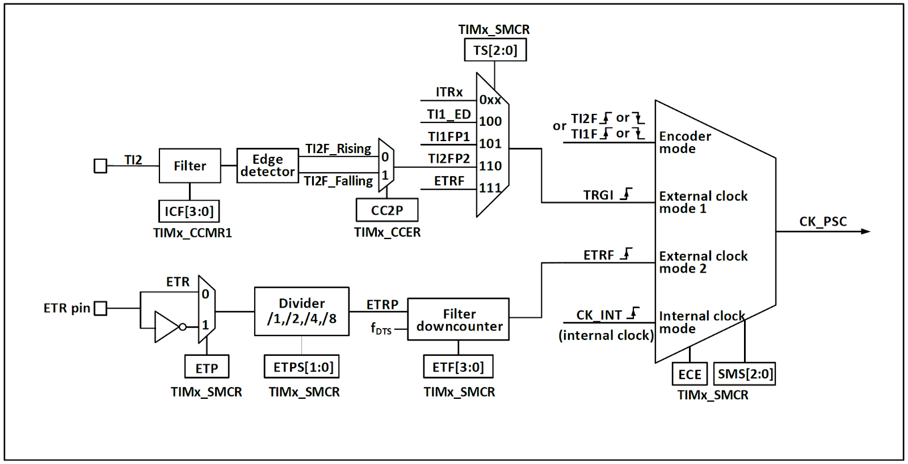
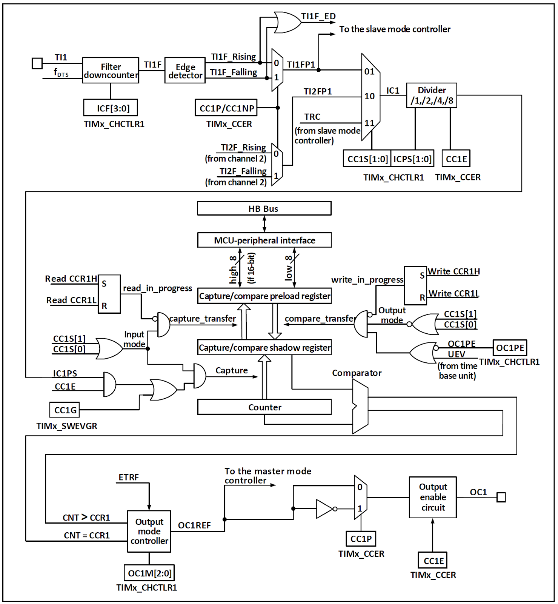

[目次に戻る](index.md)

## TIM2 汎用タイマ (GPTM)
### 概要
TIM2 汎用タイマは、[TIM1 アドバンスドタイマ](tim1.md)から一部の入出力と機能を削除したものであり、 TIM1と TIM2のレジスタ構成も同じである。

この文章では相違点のみ記述するので、詳細は [TIM1 アドバンスドタイマ](tim1.md) を参照のこと。

#### TIM2 汎用タイマと TIM1 アドバンスドコントロールタイマの違い
アドバンスドコントロールタイマと比較して、汎用タイマには以下の機能がを持たない。

1. コアカウンタのカウント周期を記録・制御するためのリピートカウントレジスタが存在しない。
2. OCx/OCxN の相補出力と、デッドタイム挿入機能（BDTR構成）を持たない。
3. BKIN入力や MOE制御による安全出力停止機構を持たない。

その他、一定期間での割り込み、外部イベントのカウント、インプットキャプチャ、コンペアマッチによる波形出力など、基本的な機能は汎用タイマでも実行可能。

#### ブロック図


CH32V003の TIM1で使用できる入出力を以下に示す。

* CH1/ETR
* CH2
* CH3
* CH4

ピン割り当ては AFIOで変更が可能。

TIM2には、TIM1に存在する相補出力端子 CHxN と、ブレーキ入力 BKINが存在しない。

### クロック入力


クロック入力は、[TIM1](tim1.md#クロック入力)と同一である。

### コンペアキャプチャチャンネル

TIM1と比較して、相補出力とデッドタイム挿入、ブレーキ信号による出力停止機能が削除されている。

### TIM2レジスタ
```c
TIM2->CTLR1
TIM2->CTLR2
TIM2->SMCFGR
TIM2->DMAINTENR
TIM2->INTFR
TIM2->SWEVGR
TIM2->CHCTLR1
TIM2->CHCTLR2
TIM2->CCER
TIM2->CNT
TIM2->PSC
TIM2->ATRLR
TIM2->CH1CVR
TIM2->CH2CVR
TIM2->CH3CVR
TIM2->CH4CVR
TIM2->DMACFGR
TIM2->DMAADR

TIM1と同様のレジスタ構成であるが、TIM1から RPTCR, BDTRが削除されているほか、各レジスタで予約になっているビットがある。
```
```
CTLR1 コントロールレジスタ1 初期値 0x0000
[   15] CAPLVL   RW ダブルエッジキャプチャでキャプチャ時の信号レベルを記録する 1:有効
                    （CHxCVRの bit16にキャプチャ時の信号レベルが記録される）
[   14] CAPOV    RW キャプチャ値モード 
                    0:オーバーフローしてもキャプチャ時のカウンタ値を記録する
                    1:キャプチャ前にカウンタがオーバフローした場合 0xffffが記録される
[13:10]          RO Reserved
[ 9: 8] CKD[1:0] RW タイマクロック分周比 デッドタイムとデジタルフィルタ (ETR, TIx) で使用される
                    00:Tdts=Tck_int    10:Tdts=Tck_int*4
                    01:Tdts=Tck_int*2  11:設定不可
                    Tck_int:RCCからの供給クロック (HCLK)
[    7] ARPE     RW オートリロード有効化 1:有効 （リロード値 ATRLR）
[ 6: 5] CMS[1:0] RW アライメントモード選択
                    00:エッジアライメントモード カウント方向ビット (DIR) に基づいてカウントする
                    01:中央アライメントモード1 加算->減算カウントを行う
                       コンペアマッチは減算時のみ発生する
                    10:中央アライメントモード2 加算->減算カウントを行う
                       コンペアマッチは加算時のみ発生する
                    11:中央アライメントモード3 加算->減算カウントを行う
                       コンペアマッチは加算時、減算時両方で発生する
                    CEN=1の時にはエッジアライメント-中央アライメントの変更はできない
[    4] DIR      RW カウント方法 0:加算カウント 1:減算カウント
[    3] OPM      RW ワンショットパルスモード
                    0:周期完了（アップデート）イベント (UEV) で停止せず動作を継続する
                    1:周期完了（アップデート）イベント (UEV) が発生すると動作を停止する (CENがクリアされる)
[    2] URS      RW 周期完了（アップデート）イベント要因選択
                    0:カウンタのオーバーフロー/アンダーフロー
                      SWEVGRの UG （リセット）
                      スレーブモード制御による更新
                    1:カウンタのオーバーフロー/アンダーフロー
[    1] UDIS     RW 更新イベント無効化
                    0:許可
                    1:無効
[    0] CEN      RW カウンタ有効 1:有効化
                    トリガモードでは、ハードウェアでセットされる。
```
```
CTLR2 コントロールレジスタ2 初期値 0x0000
[15: 8]          RO Reserved
[    7] TI1S     RW TI1入力選択
                    0:TIMx_CH1
                    1:TIMx_CH1, TIMx_CH2, TIMx_CH3 の XOR
[ 6: 4] MMS[2:0] RW マスタモード選択
                    スレーブタイマへ送信される同期出力 (TRGO) を選択する。
                    000:SWEVGRの UG （リセット）
                    001:CTLR1の CEN （タイマの起動）
                    010:周期完了（アップデート）イベント
                    011:CCxIF（キャプチャ/コンペアマッチの発生）
                    100:OC1REF（CH1のコンペアマッチ）
                    101:OC2REF
                    110:OC3REF
                    111:OC4REF
[    3] CCDS     RW インプットキャプチャ DMA要求要因選択
                    0:インプットキャプチャ発生で CHxCVR （データレジスタ）の DMA要求
                    1:更新イベントで CHxCVRの DMA要求
[ 2: 0]          RO Reserved
```
```
SMCFGR スレーブモードコントロールレジスタ 初期値 0x0000
[   15] ETP       RW ETR（外部トリガ）極性選択
                     0:立ち上がりエッジでアクティブ
                     1:立ち下がりエッジでアクティブ
[   14] ECE       RW 外部クロックモード2 有効化 1:有効
                     備考1:外部クロックモード2と同時にスレーブモードを使用することが可能。
                     ただし TRGIを ETRFに接続することはできない（TSビットに '111' を設定することは不可）
                     備考2:外部クロックモード1と外部クロックモード2の両方が有効化されている場合、外部クロック入力は ETRF に固定される
[13:12] ETPS[1:0] RW 外部トリガプリスケーラ
                     00:ETR    10:ETR/4
                     01:ETR/2  11:ETR/8
                     プリスケーラの出力 ETRPの周波数は CK_INTの 1/4を超えてはならない。
[11: 8] ETF[3:0]  RW 外部トリガフィルタ設定
                     N回連続で入力信号が同じなら、信号有効とするフィルタ
                     0000:フィルタなし   1000:Fdts/ 8, N=6
                     0001:Fck_int, N=2  1001:Fdts/ 8, N=8
                     0010:Fck_int, N=4  1010:Fdts/16, N=5
                     0011:Fck_int, N=8  1011:Fdts/16, N=6
                     0100:Fdts/ 2, N=6  1100:Fdts/16, N=8
                     0101:Fdts/ 2, N=8  1101:Fdts/32, N=5
                     0110:Fdts/ 4, N=6  1110:Fdts/32, N=6
                     0111:Fdts/ 4, N=8  1111:Fdts/32, N=8
                     Fck_int=RCCからTIM1に供給されるクロック (HCLK)
                     Fdts=CTLR1の CKDで設定したクロック
[    7] MSM       RW マスタ/スレーブモード選択
                     0:無効 マスタのゲートによりこのタイマのトリガ入力 (TRGI) が遅延する
                     1:有効 マスタのトリガ発生と、このタイマのトリガ入力が同期する
[ 6: 4] TS[2:0]   RW トリガ選択
                     000:内部トリガ (ITR0)  100:TI1のエッジ検出器 (TI1F_ED)
                     001:内部トリガ (ITR1)  101:フィルタ処理されたタイマ入力1 (TI1FP1)
                     010:内部トリガ (ITR2)  110:フィルタ処理されたタイマ入力2 (TI1FP2)
                     011:内部トリガ (ITR3)  111:外部トリガ入力 (ETRF)
                     SMSが 0の場合のみ変更可能
[    3]           RO Reserved
[ 2: 0] SMS[2:0]  RW 入力モード選択
                     000:内部クロック (CK_INT) で動作 スレーブ動作無効
                     001:エンコーダモード1 TI2FP2のエッジでカウント
                     010:エンコーダモード2 TI1FP1のエッジでカウント
                     011:エンコーダモード3 TI1FP1, TI2FP2の両エッジでカウントし、エッジを検出しなかった端子のレベルにより増減方向が変化（普通のロータリーエンコーダがこれ）
                     100:リセットモード トリガ入力(TRGI)の立ち上がりでカウンタを 0にする
                         カウントは内部クロックが使用される
                     101:ゲートモード TRGIが HIの期間をカウントする
                     110:トリガモード TRGIの立ち上がりでカウントを開始する
                     111:外部クロックモード1 TRGIの立ち上がりをカウントする
```
エンコーダモードの信号は [エンコーダモード](#エンコーダモード-1)の説明を参照

```
DMAINTENR DMA/割り込み 有効化レジスタ 初期値 0x0000
[   15]       RO Reserved
[   14] TDE   RW トリガDMA有効化 1:有効
[   13]       RO Reserved
[   12] CC4DE RW コンペア/キャプチャ CH4 DMA有効化
[   11] CC3DE RW コンペア/キャプチャ CH3 DMA有効化
[   10] CC2DE RW コンペア/キャプチャ CH2 DMA有効化
[    9] CC1DE RW コンペア/キャプチャ CH1 DMA有効化
[    8] UDE   RW 周期完了（アップデート）イベントDMA有効化
[    7]       RO Reserved
[    6] TIE   RW トリガ割り込み有効化
[    5]       RO Reserved
[    4] CC4IE RW コンペア/キャプチャ CH4 割り込み有効化
[    3] CC3IE RW コンペア/キャプチャ CH3 割り込み有効化
[    2] CC2IE RW コンペア/キャプチャ CH2 割り込み有効化
[    1] CC1IE RW コンペア/キャプチャ CH1 割り込み有効化
[    0] UIE   RW 周期完了（アップデート）イベント割り込み有効化
```
```
INTFR 割り込みステータスレジスタ 初期値 0x0000
[15:13]       RO  Reserved
[   12] CC4OF RW0 インプットキャプチャ CH4 オーバーキャプチャフラグ
                  1:キャプチャ値を読み取る前に次のインプットキャプチャが発生した
[   11] CC3OF RW0 インプットキャプチャ CH3 オーバーキャプチャフラグ
[   10] CC2OF RW0 インプットキャプチャ CH2 オーバーキャプチャフラグ
[    9] CC1OF RW0 インプットキャプチャ CH1 オーバーキャプチャフラグ
[ 8: 7]       RO  Reserved
[    6] TIF   RW0 トリガ割り込みフラグ
[    5]       RO  Reserved
[    4] CC4IF RW0 コンペア/キャプチャ CH4 割り込みフラグ
[    3] CC3IF RW0 コンペア/キャプチャ CH3 割り込みフラグ
[    2] CC2IF RW0 コンペア/キャプチャ CH2 割り込みフラグ
[    1] CC1IF RW0 コンペア/キャプチャ CH1 割り込みフラグ
[    0] UIF   RW0 周期完了（アップデート）割り込みフラグ
RW0:ハードウエアによってセットされ、0書き込みでクリアされる
CCxOFはインプットキャプチャモードでのみ有効
```
```
SWEVGR イベント生成レジスタ 初期値 0x0000
[15: 7]      RO Reserved
[    6] TG   WO トリガイベント生成
[    5]      RO Reserved
[    4] CC4G WO コンペア/キャプチャイベント4 生成
[    3] CC3G WO コンペア/キャプチャイベント3 生成
[    2] CC2G WO コンペア/キャプチャイベント2 生成
[    1] CC1G WO コンペア/キャプチャイベント1 生成
[    0] UG   WO 周期完了（アップデート）イベント生成
外部端子やカウンタ一致で発生するイベントを、ソフトウェアで強制的に発生させるためのレジスタ
1を書くとイベント生成
```
```
CHCTLR1 コンペア/キャプチャコントロールレジスタ1 初期値 0x0000
コンペアマッチ出力モード
[   15] OC2CE     RW コンペア/キャプチャCH2 クリア設定
                     1:外部トリガ入力 (ETRF) が HI で コンペア出力2 (OC2REF) を 0 にする
[14:12] OC2M      RW コンペア出力信号2 (OC2REF) 動作設定 
                     000:信号出力なし
                     001:コンペアマッチで 1 を出力
                     010:コンペアマッチで 0 を出力
                     011:コンペアマッチで出力を反転
                     100:常に 0 を出力
                     101:常に 1 を出力
                     110:PWMモード1 アップカウント時、CNT < CVR で 1出力, それ以外 0出力
                                    ダウンカウント時、CNT > CVR で 0出力, それ以外 1出力
                     111:PWMモード2 アップカウント時、CNT < CVR で 0出力, それ以外 1出力
                                    ダウンカウント時、CNT > CVR で 1出力, それ以外 0出力
[   11] OC2PE     RW コンペア/キャプチャレジスタ2 (CH2CVR) プリロード有効化
                     1:レジスタ更新後次の周期完了（アップデート）イベントでレジスタ反映
                     0:レジスタ更新即反映
                     CH2CVR書き込みタイミングによって、一周期の中で信号が複数回変化したり全く変化しないことがないように、レジスタ値の反映を周期完了時に限定する機能。
[   10] OC2FE     RW コンペア/キャプチャCH2 高速応答有効化
                     0:無効 出力最小遅延 5クロック 1:有効 出力最小遅延 3クロック
                     フィルタを無効化するか何かで応答を高速化する
                     PWMモード1か PWMモード2でのみ有効
[ 9: 8] CC2S[1:0] RW コンペア/キャプチャCH2 入出力選択
                     00:出力
                     01:TI2ピン入力
                     10:TI1ピン入力
                     11:トリガコントローラから入力 (TRC)
                        SMCFGRの TSで内部トリガ入力が選択されている場合のみ
                     コンペアマッチ出力モードでは 00を設定する
[    7] OC1CE     RW コンペア/キャプチャCH1 クリア設定
[ 6: 4] OC1M      RW コンペア出力信号1 (OC1REF) 動作設定 
[    3] OC1PE     RW コンペア/キャプチャレジスタ1 (CH2CVR) プリロード有効化
[    2] OC1FE     RW コンペア/キャプチャCH1 高速応答有効化
[ 1: 0] CC1S[1:0] RW コンペア/キャプチャCH1 入出力選択
                     00:出力
                     01:TI1ピン入力
                     10:TI2ピン入力
                     11:トリガコントローラから入力 (TRC)
                        SMCFGRの TSで内部トリガ入力が選択されている場合のみ

インプットキャプチャモード
[15:12] IC2F        RW インプットキャプチャCH2 入力フィルタ設定
                       N回連続で入力信号が同じなら、信号有効とするフィルタ
                       0000:フィルタなし   1000:Fdts/ 8, N=6
                       0001:Fck_int, N=2  1001:Fdts/ 8, N=8
                       0010:Fck_int, N=4  1010:Fdts/16, N=5
                       0011:Fck_int, N=8  1011:Fdts/16, N=6
                       0100:Fdts/ 2, N=6  1100:Fdts/16, N=8
                       0101:Fdts/ 2, N=8  1101:Fdts/32, N=5
                       0110:Fdts/ 4, N=6  1110:Fdts/32, N=6
                       0111:Fdts/ 4, N=8  1111:Fdts/32, N=8
                       Fck_int=RCCからTIM1に供給されるクロック (HCLK)
                       Fdts=CTLR1の CKDで設定したクロック
[11:10] IC2PSC[1:0] RW インプットキャプチャCH2 入力プリスケーラ
                       00:プリスケーラなし  10:IC / 4
                       01:IC2 / 2          11:IC / 8
                       CC1E=0 (タイマ出力無効) にするとプリスケーラの内部カウンタはリセットされる。
                       次に出力有効にした時に、入力が正しくカウントされる。
[ 9: 8] CC2S[1:0]   RW コンペア/キャプチャCH2 入出力選択
                       00:出力
                       01:TI2ピン入力
                       10:TI1ピン入力
                       11:トリガコントローラから入力 (TRC) 内部トリガ
                          SMCFGRの TSで内部トリガ入力が選択されている場合のみ
                       インプットキャプチャモードでは 01, 10, 11 のいずれかを設定する
[ 7: 4] IC1F        RW インプットキャプチャCH1 入力フィルタ設定
[ 3: 2] IC1PSC[1:0] RW インプットキャプチャCH1 入力プリスケーラ
[ 1: 0] CC1S[1:0]   RW コンペア/キャプチャCH1 入出力選択
                       00:出力
                       01:TI1ピン入力
                       10:TI2ピン入力
                       11:トリガコントローラから入力 (TRC)
                          SMCFGRの TSで内部トリガ入力が選択されている場合のみ
```
```
CHCTLR2 コンペア/キャプチャコントロールレジスタ2 初期値 0x0000
コンペアマッチ出力モード
[   15] OC4CE     RW コンペア/キャプチャCH4 クリア設定
[14:12] OC4M      RW コンペア出力信号4 (OC4REF) 動作設定 
[   11] OC4PE     RW コンペア/キャプチャレジスタ4 (CH2CVR) プリロード有効化
[   10] OC4FE     RW コンペア/キャプチャCH4 高速応答有効化
[ 9: 8] CC4S[1:0] RW コンペア/キャプチャCH4 入出力選択
                     00:出力
                     01:TI4ピン入力
                     10:TI3ピン入力
                     11:トリガコントローラから入力 (TRC)
                        SMCFGRの TSで内部トリガ入力が選択されている場合のみ
[    7] OC3CE     RW コンペア/キャプチャCH3 クリア設定
[ 6: 4] OC3M      RW コンペア出力信号1 (OC1REF) 動作設定 
[    3] OC3PE     RW コンペア/キャプチャレジスタ3 (CH3CVR) プリロード有効化
[    2] OC3FE     RW コンペア/キャプチャCH3 高速応答有効化
[ 1: 0] CC3S[1:0] RW コンペア/キャプチャCH3 入出力選択
                     00:出力
                     01:TI3ピン入力
                     10:TI4ピン入力
                     11:トリガコントローラから入力 (TRC)
                        SMCFGRの TSで内部トリガ入力が選択されている場合のみ

インプットキャプチャモード
[15:12] IC4F        RW インプットキャプチャCH3 入力フィルタ設定
[11:10] IC4PSC[1:0] RW インプットキャプチャCH3 入力プリスケーラ
[ 9: 8] CC4S[1:0]   RW コンペア/キャプチャCH3 入出力選択
                       00:出力
                       01:TI4ピン入力
                       10:TI3ピン入力
                       11:トリガコントローラから入力 (TRC)
                          SMCFGRの TSで内部トリガ入力が選択されている場合のみ
[ 7: 4] IC3F        RW インプットキャプチャCH3 入力フィルタ設定
[ 3: 2] IC3PSC[1:0] RW インプットキャプチャCH3 入力プリスケーラ
[ 1: 0] CC3S[1:0]   RW コンペア/キャプチャCH3 入出力選択
                       00:出力
                       01:TI3ピン入力
                       10:TI4ピン入力
                       11:トリガコントローラから入力 (TRC)
                          SMCFGRの TSで内部トリガ入力が選択されている場合のみ

CCxS フィールドは、チャネルがオフ（CCER レジスタの CCxE=0）のときにのみ書き込み可
能。
```
入出力選択は [タイマブロック図](#ブロック図)、[コンペア/キャプチャブロック図](#コンペアキャプチャチャンネル)参照


```
CCER コンペア/キャプチャEnableレジスタ 初期値 0x0000
[15:14]       RO Reserved
[   13] CC4P  RW CH4 入出力極性設定
                     出力構成時 0:アクティブHI 1:アクティブLO
                     入力構成時 0:立ち上がり 1:立ち下がり
[   12] CC4E  RW CH4 入出力有効
                     出力構成時 0:出力無効 1:出力有効
                     入力構成時 0:入力無効 1:入力有効
[   11] CC3NP RW CH4 相補出力極性設定
[   10] CC3NE RW CH4 相補出力有効
[    9] CC3P  RW CH4 入出力極性設定
[    8] CC3E  RW CH4 入出力有効
[    7] CC2NP RW CH4 相補出力極性設定
[    6] CC2NE RW CH4 相補出力有効
[    5] CC2P  RW CH4 入出力極性設定
[    4] CC2E  RW CH4 入出力有効
[    3] CC1NP RW CH4 相補出力極性設定
[    2] CC1NE RW CH4 相補出力有効
[    1] CC1P  RW CH4 入出力極性設定
[    0] CC1E  RW CH4 入出力有効
```
```
CNT タイマカウンタ 初期値 0x0000
[15: 0] CNT[15:0]   RW タイマカウンタ
```
```
PSC カウントクロックプリスケーラ 初期値 0x0000
[15: 0] PSC[15:0]   RW カウンタ入力のプリスケーラ
                       CK_CNT = CK_PSC / (1 + PSC)
```
```
ATRLR オートリロード値レジスタ 初期値 0xffff
[15: 0] ATRLR[15:0] RW リロードレジスタ
                       周期完了で CNTへリロードされる
```
```
CH1CVR コンペアキャプチャレジスタ1 初期値 0x00000000
[31:17]        RO Reserved
[   16] LEVEL1 RO キャプチャ信号レベル
                   インプットキャプチャ時の入力信号。両エッジでキャプチャしたときの判別用
[15: 0] CH1CVR RW コンペア/キャプチャ値レジスタ

CH2CVR コンペアキャプチャレジスタ2 初期値 0x00000000
[31:17]        RO Reserved
[   16] LEVEL2 RO キャプチャ信号レベル
[15: 0] CH2CVR RW コンペア/キャプチャ値

CH3CVR コンペアキャプチャレジスタ3 初期値 0x00000000
[31:17]        RO Reserved
[   16] LEVEL3 RO キャプチャ信号レベル
[15: 0] CH3CVR RW コンペア/キャプチャ値

CH4CVR コンペアキャプチャレジスタ4 初期値 0x00000000
[31:17]        RO Reserved
[   16] LEVEL4 RO キャプチャ信号レベル
[15: 0] CH3CVR RW コンペア/キャプチャ値
```
```
DMACFGR DMAコントロールレジスタ 初期値 0x0000
[15:13] RO Reserved
[12: 8] DBL[4:0] RW DMA連続転送の長さ（0:1回 1:2回 2:3回 ...）
[ 7: 5] RO Reserved
[ 4: 0] DBA[4:0] RW DMAオフセットアドレス
                    DMAでアクセスする対象レジスタを、コントロールレジスタ1 からの相対位置で指定する。（CH1CVRなら13）
```
```
DMAADR DMAバーストアクセスレジスタ 初期値 0x0000
[15: 0] DMAB[15: 0] RW DMAバーストアクセスレジスタ 
                       DMACFGRで指定したレジスタへアクセスするための窓口（レジスタ）
TIM1のレジスタのアドレスが連続しておらず DMAで扱いにくいので、DMACFGRとDMAADRで簡単に扱えるようにしている。
```

### この文章のライセンス
[CC0 1.0 Universal](https://github.com/KyoichiSato/ch32v003-getting-started-ja/blob/main/LICENSE)

{{page.date}}作成 {{page.updated}}更新 佐藤恭一 [kyoutan.jpn.org](https://kyoutan.jpn.org)

[目次に戻る](index.md)
