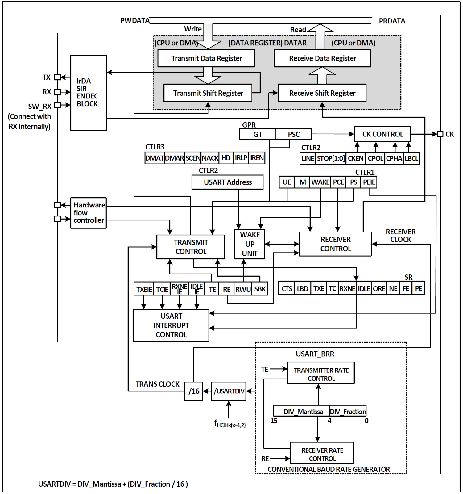
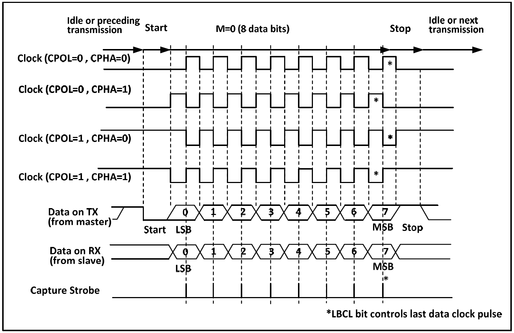
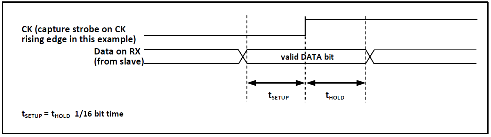
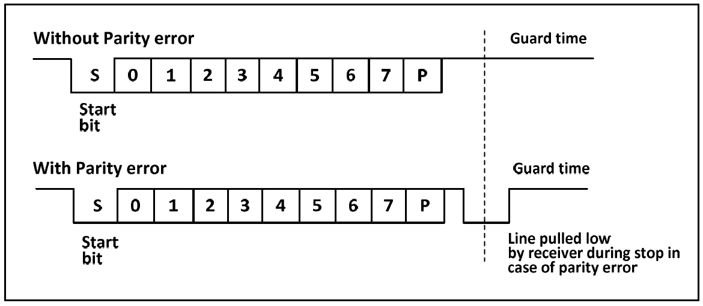

[目次に戻る](index.md)

## USART ユニバーサル同期/非同期受送信機

- 全二重 / 半二重 の 同期 / 非同期 通信に対応
- NRZ (Non-Return-to-Zero) データフォーマット
- 分数型ボーレートジェネレータ（最大3Mbps）
- データ長を 8bit, 9bitから選択可能
- ストップビットの構成可能
- LIN, IrDAエンコーダ, スマートカード対応
- DMA (Direct Memory Access) サポート
- 複数の割り込みソースに対応

### 概要


#### 受信動作
TE (transmit enable bit) がセットされると、送信シフトレジスタ内のデータが TX ピンに出力され、クロックが CK ピンに出力される。

データの送信は Low のスタートビットで開始され、最初に出力されるデータビットは最下位ビットである。M (word length) ビットの設定に応じて 8bit または 9bit のデータが送信され、パリティチェックビットが有効な場合、データの後にパリティビットが付加される。最後に設定可能な長さのストップビットが送出されて送信が終了する。

実際の送信動作では、TE がセットされた後、Highが 10bit または 11bit のアイドルフレームが送信されてから、データの送信が行われる。

SBKビットによるブレイクフレーム送出では Low が 10bit または 11bit 続いた後に、ストップビットが付加される。

#### ボーレートジェネレータ
送受信機のボーレート = HCLK / (16 * USARTDIV) 

であり、HCLK は HB のクロックである。USARTDIV の値は USART_BRR 内の DIV_M および DIV_F フィールドによって決定され、以下の式で算出される。

USARTDIV = DIV_M + (DIV_F / 16)

ボーレートジェネレータによって生成されるボーレートは、誤差が発生する場合があるが、最も近い値を選択する以外に、HB クロック周波数を上げることで誤差を低減することもできる。

例えば、HCLKが 48MHzの時にボーレートを 76800bps に設定する場合、USARTDIV の値を 39.0625 に設定すると、正確に 76800bps が得られる。

一方、921600bps が必要な場合、USARTDIV の値は約 3.255 である。USART_BRR に実際に設定可能な最も近い値は 3.25 であり、実際のボーレートは 923076bps となる。誤差は 0.16% である。

送信側から送られた送信波形が受信側に伝送される際、送信側と受信側のボーレートには誤差が生じる。主な誤差要因は以下の三点である。

* 送信側と受信側の実際のボーレートが一致しない
* 両者のクロックに誤差がある
* 伝送線上の波形変化によるもの

受信側には一定の受信許容誤差があり、上記三点の合計誤差がモジュールの許容限界を下回る場合は送受信に影響はない。

許容限界はボーレートレジスタの小数部の使用とデータ長によって影響を受け、小数部および 9bitデータ長を使用すると許容限界は低下するが、誤差が 3%未満であれば通信可能である。

##### 設定値の計算
ボーレートレジスタに設定する値を計算すると

```
ボーレート = HCLK / (16 * USARTDIV) 
USARTDIV = DIV_M + (DIV_F / 16)

(16 * USARTDIV) = HCLK / ボーレート
USARTDIV = HCLK / ボーレート /16

整数部 DIV_M = HCLK / ボーレート / 16
小数部 DIV_F = (HCLK / ボーレート) & 0x0f
（DIV_Fは 4bitなので下位 4bitだけ取り出す）
```

となる。

#### 同期モード
同期モードでは、データを送信時に CK ピンからクロック信号を出力する。

同期モードを有効にするには、コントロールレジスタ2の CLKEN ビットをセットする。また、LIN モード、スマートカードモード、赤外線モード、半二重モードが無効になっている必要がる。

クロック出力制御について、いくつかの注意点が存在する。

* USART モジュールの同期モードはメインモードでのみ動作し、CK ピンはクロックのみを出力し、入力は受け付けない。
* TX ピンからデータが出力されるときのみクロック信号が出力される。
* LBCL ビットは最後のデータビット送信時にクロックを出力するかどうかを決定し、CPOL ビットはクロックの極性を、CPHA ビットはクロックの位相を決定する。これら 3 ビットはコントロールレジスタ2にあり、TE=0、RE=0 の状態で設定する必要がある。
* 受信側は出力クロックに同期してサンプリングを行うため、一定の信号立ち上がり時間および保持時間が必要となる。

##### クロックタイミング


##### データのサンプルと保持時間


#### 1-wire 半二重モード
半二重モードでは、1本のピン (TX ピンのみ) を使用して送受信を行うことができ、TX ピンと RX ピンはチップ内部で接続されている。

半二重モードを有効にするには、コントロールレジスタ3の HDSEL ビットをセットする。また、LIN モード、スマートカードモード、赤外線モード、同期モードは無効になっている必要がある。

設定後は、TX の I/O ポートをオープンドレイン出力 High モードに設定する必要がある。TE をセットすると、データレジスタに書き込まれたデータは即座に送信される。

半二重モードでは、複数のデバイスが単一バスで送受信を行う場合にバス競合が発生する可能性があるため、ユーザがソフトウェアで回避する必要がある。

#### スマートカード
スマートカードモードは、ISO7816-3 プロトコルに準拠したスマートカードコントローラへのアクセスをサポートする。

スマートカードモードを有効にするには、コントロールレジスタ3の SCEN ビットをセットする。また、LIN モード、ハーフデュプレックスモード、赤外線モードが無効になっている必要がある。クロック出力のために CLKEN は有効にしてもよい。

スマートカードモードでは、USART を 8bit データ + 1bit パリティに設定し、ストップビットは送受信ともに 1.5bit に設定することが推奨される。スマートカードモードは 1-wire 半二重プロトコルであり、TX ラインを用いてデータ通信を行うため、TX はオープンドレイン出力でプルアップを有効に設定する必要がある。

受信側がデータフレームを受信しパリティエラーを検出した場合、ストップビット期間中に 1サイクルだけ TX を Low に駆動することで NACK 信号を送信側へ伝達する。

送信側はこの NACK 信号を検出し、フレームエラーを生成するので、アプリケーション側で再送処理を行うことが可能となる。

USART の TC フラグ （送信完了） により、GT （ガードタイム） の生成を 1クロック遅延させることができ、受信側は自身が設定した NACK 信号をスタートビットとして誤認識することはない。

##### パリティーエラー時の波形


スマートカードモードにおいて、CK ピンから出力される波形は通信とは無関係であり、単にスマートカードに対してクロックを供給するものである。
このクロックは AHB クロックを基準とし、5bitの設定可能なクロック分周器によって分周される。

#### IrDA
USART モジュールは、IrDA 赤外線トランシーバの制御をサポートする。

IrDA を使用するには、LINEN、STOP、CLKEN、SCEN、HDSEL ビットをクリアする必要がある。

USART モジュールと SIR 物理層 (赤外線トランシーバ) 間では NRZ (non-return to zero) 符号化が使用され、最大 115200bps まで対応する。

IrDA は半二重プロトコルであり、USART が SIR 物理層へデータを送信している場合、IrDA デコーダは新たに送信された赤外線信号を無視する。USART が SIR からデータを受信している場合、SIR は USART からの信号を受け付けない。

USART から SIR、および SIR から USART へのレベル論理は異なる。SIR の受信論理では High レベルが 1、Low レベルが 0 であるが、SIR の送信論理では High レベルが 0、Low レベルが 1 である。

#### DMA
USART モジュールは DMA 機能をサポートしており、高速かつ連続的な送受信を実現できる。

DMA が有効な場合、TXE がセットされると、DMA は設定されたメモリ領域から送信バッファへデータを書き込む。

DMA を使用して受信する場合、RXNE がセットされるたびに、DMA は受信バッファ内のデータを特定のメモリ領域へ転送する。

#### 割り込み
USARTモジュールは、以下を含む複数の割り込み要因をサポートしている

* 送信データレジスタ空(TXE)
* CTS
* 送信完了(TC)
* 受信データ準備完了(RXNE)
* データオーバーフロー(ORE)
* ラインアイドル(IDLE)
* パリティエラー(PE)
* 切断フラグ(LBD)
* ノイズ(NE)
* マルチバッファ通信におけるオーバーフロー(ORT)
* およびフレームエラー(FE)など。

|割り込みソース         |有効ビット|
|----------------------|----------|
|送信データ空 (TXE)      |TXEIE    |
|送信許可 (CTS)         |CTSIE    |
|送信完了 (TC)          |TCIE     |
|受信データあり (RXNE)<br/>
 オーバーランエラー (ORE)|RXNEIE   |
|アイドル検出 (IDLE)     |IDLEIE   |
|パリティエラー (PE)     |PEIE     |
|ブレイク (LBD)          |LBDIE    |
|ノイズフラグ (NE)<br/>
 オーバーフロー (ORE)<br/>
 フレームエラー          |EIE      |

### USARTレジスタ
```c
USART1->STATR
USART1->DATAR
USART1->BRR
USART1->CTLR1
USART1->CTLR2
USART1->CTLR3
USART1->GPR
```
```
STATR ステータスレジスタ 初期値 0x000000c0
[31:10] RO Reserved
[    9] CTS  RW0 CTS状態変化フラグ        1:nCTS端子変化あり
[    8] LBD  RW0 LINブレイクフラグ        1:ブレイク検出
[    7] TXE  RO  送信データレジスタエンプティフラグ 1:送信データなし
[    6] TC   RW0 送信完了フラグ           1:送信完了
[    5] RXNE RW0 受信データありフラグ      1:受信データあり
[    4] IDLE RO  バスアイドルフラグ        1:アイドル状態
[    3] ORE  RO  オーバーロードエラーフラグ 1:受信データを読み出す前に次のデータを受信した
                 （後から受信したデータは捨てられる）
[    2] NE   RO  ノイズエラーフラグ         1:エラー
[    1] FE   RO  フレーミングエラーフラグ   1:エラー
[    0] PE   RO  パリティエラーフラグ       1:エラー
```
```
DATAR データレジスタ 初期値 0x000000xx
[31: 9]         RO Reserved
[ 8: 0] DR[8:0] RW データレジスタ
読み出しは受信データレジスタからの読み出し、書き込みは送信データレジスタへの書き込みになる。
```
```
BRR ボーレートレジスタ 初期値 0x00000000
[31:16]                    RO Reserved
[15: 4] DIV_Mantissa[11:0] RW 分周器の整数部
[ 3: 0] DIV_Fraction[3:0]  RW 分周器の小数部
```
```
CTLR1 コントロールレジスタ1 初期値 0x00000000
[31:14] RO Reserved
[   13] UE     RW USARTイネーブル
                  0を書いた場合、現在の通信が完了してから動作が停止する
[   12] M      RW データ長設定 0:8bit 1:9bit
[   11] WAKE   RW ウェイクアップ選択 0:バスアイドル 1:アドレスマーカー
[   10] PCE    RW パリティイネーブル
[    9] PS     RW パリティ選択 0:偶数パリティ 1:奇数パリティ
[    8] PEIE   RW パリティエラー割り込みイネーブル
[    7] TXEIE  RW 送信データレジスタ空割り込みイネーブル
[    6] TCIE   RW 送信完了割り込みイネーブル
[    5] RXNEIE RW 受信データあり割り込みイネーブル
[    4] IDLEIE RW バスアイドル割り込みイネーブル
[    3] TE     RW 送信イネーブル
[    2] RE     RW 受信イネーブル
[    1] RWU    RW 受信ウェイクアップ
                  0:レシーバは通常動作モード
                  1:レシーバはサイレントモード
[    0] SBK    RW ブレイク送信ビット
```
```
CTLR2 コントロールレジスタ2 初期値 0x00000000
[31:15]           RO Reserved
[   14] LINEN     RW LINモードイネーブル
[13:12] STOP[1:0] RW ストップビット設定
                     00:1    10: 2
                     01:0.5  11: 1.5
                     （設定値の並びが不自然だけれど、STM32も同じなので多分これであっている）
[   11] CLKEN     RW クロックイネーブル
[   10] CPOL      RW クロック極性 0:アイドル時 CK=0 1:アイドル時 CK=1
[    9] CPHA      RW クロック位相 0:最初のCK偏移でデータキャプチャ開始 1:2番目のCK偏移でキャプチャ
[    8] LBCL      RW 最終ビットクロックパルス出力 0:しない 1:する
[    7]           RO Reserved
[    6] LBDIE     RW LINブレイク割り込みイネーブル
[    5] LBDL      RW LINブレイク検出長 0:10bit 1:11bit
[    4]           RO Reserved
[ 3: 0] ADD[3:0]  RW USARTノードアドレス
                     マルチプロセッサ通信で使用する本機のアドレスで、アドレスマークによるウェイクアップに使用される。

CPOL=0, CPHA=0 _____+--+__+--+__
CPOL=0, CPHA=1 __+--+__+--+__+--
CPOL=1, CPHA=0 -----+__+--+__+--
CPOL=1, CPHA=1 --+__+--+__+--+__
                    ^     ^
                    +-----+-- データキャプチャ
```
```
CTLR3 コントロールレジスタ3 初期値 0x00000000
[31:11]       RO Reserved
[   10] CTSIE RW CTS割り込みイネーブル
[    9] CTSE  RW CTSイネーブル
[    8] RTSE  RW RTSイネーブル
[    7] DMAT  RW 送信DMAイネーブル
[    6] DMAR  RW 受信DMAイネーブル
[    5] SCEN  RW スマートカードモードイネーブル
[    4] NACK  RW スマートカードNACKイネーブル
[    3] HDSEL RW 半二重モードイネーブル
[    2] IRLP  RW IrDA低電力モードイネーブル（IREN=1の時のみ有効）
[    1] IREN  RW IrDAモードイネーブル
[    0] EIE   RW エラー割り込みイネーブル
                 受信DMA有効 (DMAR=1) のときに通信エラーが発生すると割り込みが発生
CTS (Clear To Send)   送信許可 CTS=0の間、次のデータ送信を一時保留
RTS (Request To Send) 送信要求 USARTが受信可能なら RTS=1 になる
```
```
GPR プロテクションタイム/プリスケーラレジスタ 初期値 0x00000000
[31:16]          RO Reserved
[15: 8] GT[7:0]  RW ガードタイム値（スマートカードモード用）
[ 7: 0] PSC[7:0] RW プリスケーラ値
                    IrDA省電力モードでは、ソースクロックがこの値で除算される。
                    通常のIrDAモードでは、1のみ設定可能。
                    スマートカードモードでは、ソースクロックがこの値の 2倍で除算されて
                    スマートカードのクロックとして使われる。（下位 5bitが有効）
```

### この文章のライセンス
[CC0 1.0 Universal](https://github.com/KyoichiSato/ch32v003-getting-started-ja/blob/main/LICENSE)

{{page.date}}作成 {{page.updated}}更新 佐藤恭一 [kyoutan.jpn.org](https://kyoutan.jpn.org)

[目次に戻る](index.md)
